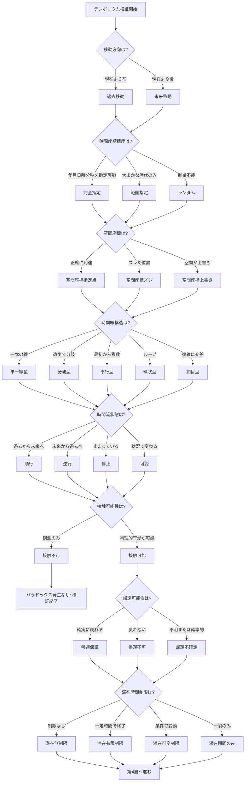
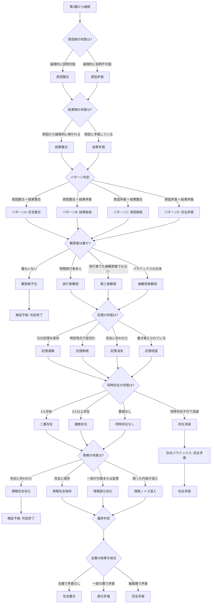

## 付録A：統合フローチャート

### A-1. 概要

本付録では、テンポリウムの全層を統合したフローチャートを提示する。

---

### A-2. 第0層〜第3層：移動条件群フロー

---

### A-3. 第4層〜第6層：状態判定群フロー

---

### A-4. 最終判定サマリ

|判定|条件|結論|
|---|---|---|
|完全整合|全層で矛盾なし|パラドックスは発生しない|
|部分矛盾|一部の層で矛盾|条件付きでパラドックスが発生|
|完全矛盾|複数層で矛盾、パターンD、存在消滅|パラドックスが完全に成立|
|検証不能|観測者不在、情報完全劣化|判定自体が不可能|
|発生なし|接触不可|干渉不能のためパラドックスなし|

---
