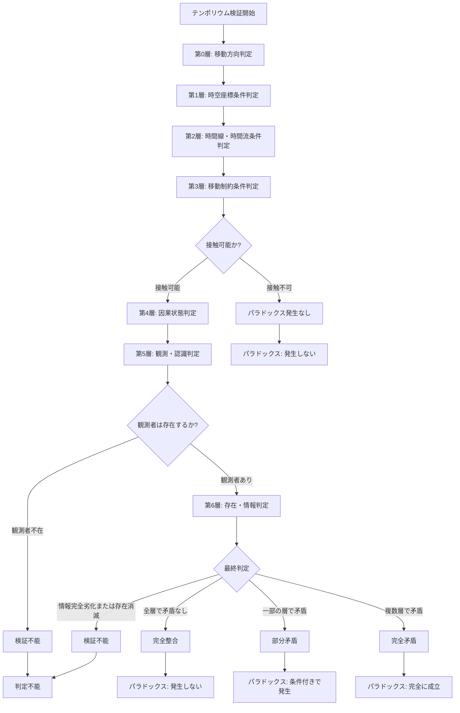

## 第10章：結論

### 10-1. まとめ

テンポリウムは、タイムパラドックスの発生条件と成立可否を検証するための完全独自体系である。

本フレームワークの特徴を以下にまとめる。

| 特徴  | 内容                            |
| --- | ----------------------------- |
| 独立性 | 特定の理論を前提とせず、理論中立の立場で条件を定義している |
| 網羅性 | 時間旅行の条件を7層15カテゴリ55用語で網羅       |
| 論理性 | 全ての判定がYes/Noの分岐で構成される         |
| 汎用性 | 理論検証、創作、思考実験など多様な用途に適用可能      |
| メタ性 | 既存理論の妥当性を評価するフレームワークとしても機能    |

---

### 10-2. フレームワーク構造の総括

|層|名称|カテゴリ数|用語数|役割|
|---|---|---|---|---|
|第0層|移動方向|1|2|過去か未来かを判定|
|第1層|時空座標条件|2|7|いつ・どこに到達するかを判定|
|第2層|時間線・時間流条件|2|11|時間の構造と流れを判定|
|第3層|移動制約条件|3|9|接触・帰還・滞在の制約を判定|
|第4層|因果状態判定|3|10|因果関係の矛盾・整合を判定|
|第5層|観測・認識判定|2|9|観測者と記憶の状態を判定|
|第6層|存在・情報判定|2|7|同時存在と情報劣化を判定|
|**合計**||**15**|**55**||

---

### 10-3. 最終判定の分類

|判定|英語|条件|意味|
|---|---|---|---|
|完全整合|Full Alignment|全層で矛盾なし|パラドックスは発生しない|
|部分矛盾|Partial Contradiction|一部の層で矛盾|条件付きでパラドックスが発生|
|完全矛盾|Full Contradiction|複数層で矛盾|パラドックスが完全に成立|
|検証不能|Unverifiable|観測者不在、情報完全劣化、存在消滅|判定自体が不可能|

---

### 10-4. 応用可能性

テンポリウムは以下の用途に応用可能である。

|用途|内容|具体例|
|---|---|---|
|理論検証|既存理論の妥当性を評価|ノヴィコフ原理がどの条件で成立するかを検証|
|フィクション創作|物語の整合性をチェック|映画・小説の時間旅行設定の矛盾を発見|
|思考実験|哲学的議論の土台|祖父殺しのパラドックスを条件別に分析|
|行動指針|パラドックス回避の設計|時間旅行が実現した際のガイドライン|
|ゲーム設計|時間旅行ゲームのルール構築|パラドックス発生条件をゲームメカニクスに|

---

### 10-5. 既存理論との関係

テンポリウムは既存理論を否定するものではなく、それらを評価するメタフレームワークとして位置づけられる。

|既存理論|テンポリウムでの評価観点|
|---|---|
|ノヴィコフ自己無撞着性原理|どの時間線構造・移動制約を前提としているか|
|多世界解釈|分岐型時間線を前提とした場合の整合性|
|ブロック宇宙論|単一線型・順行を前提とした場合の帰結|
|時間順序保護仮説|移動制約条件での「不可能」の位置づけ|
|CTC理論|環状型時間線での自己無撞着条件|

---

### 10-6. 今後の課題

|課題|内容|優先度|
|---|---|---|
|実証検証|時間旅行が実現した際の実データでの検証|長期|
|詳細化|各カテゴリのさらなる細分化|中期|
|ツール化|自動判定システムの構築|短期|
|事例分析|フィクション作品への適用事例の蓄積|短期|
|理論対応|新たな時間旅行理論との対応表の作成|中期|

---

### 10-7. 統合判定フロー

---

### 10-8. 結語

テンポリウムは、時間旅行に関する条件を体系的に定義し、パラドックスの発生と回避を条件の組み合わせによって判定可能にする独自フレームワークである。

本フレームワークが提示するのは、「パラドックスは回避される」という結論ではなく、「どの条件下でパラドックスが発生し、どの条件下で発生しないか」を明確にする判定基準である。

時間旅行が実現した未来において、本フレームワークがパラドックス回避の指針として、あるいは時間旅行理論の検証基盤として活用されることを期待する。

---
