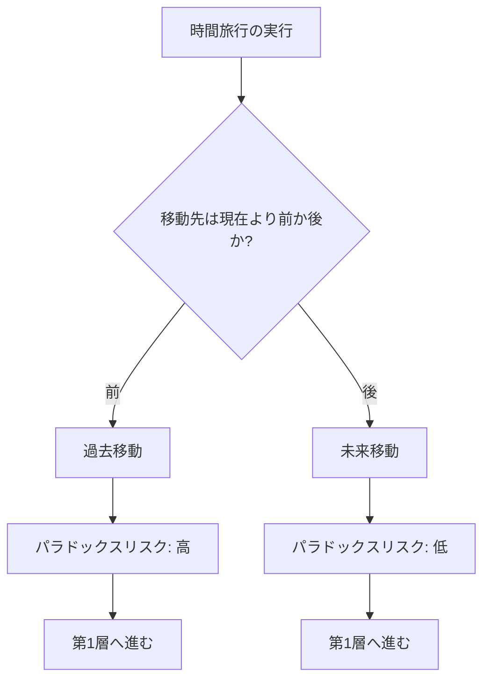

## 第3章：第0層 - 移動方向

### 3-1. 概要

第0層は、時間旅行の最も基本的な判定を行う。移動先が現在より前（過去）か後（未来）かを特定する。

この判定は、以降の全ての層に影響を与える最上位の分岐点である。

|項目|内容|
|---|---|
|層名|第0層：移動方向|
|英語名|Movement Direction|
|カテゴリ数|1|
|用語数|2|
|役割|時間旅行の方向を特定する|

---

### 3-2. 用語定義

|用語|英語|定義|
|---|---|---|
|過去移動|Past Movement|現在より前の時間座標点への移動|
|未来移動|Future Movement|現在より後の時間座標点への移動|

---

### 3-3. 過去移動と未来移動の違い

|観点|過去移動|未来移動|
|---|---|---|
|因果関係|破壊の可能性あり|破壊の可能性なし|
|パラドックス|発生しうる|原理的に発生しにくい|
|情報の流れ|逆行（未来→過去）|順行（現在→未来）|
|歴史への影響|改変の可能性あり|「まだ起きていない」ので改変ではない|
|自己との遭遇|過去の自分に会える|未来の自分に会える|
|物理的実現性|理論的に困難|相対性理論で証明済み|

---

### 3-4. 判定フロー

---

### 3-5. 移動方向による影響

移動方向によって、後続の層での判定が大きく変わる。

|移動方向|第4層（因果状態）への影響|第5層（観測・認識）への影響|第6層（存在・情報）への影響|
|---|---|---|---|
|過去移動|原因矛盾が発生しうる|被観測者観測が可能|同時存在が発生しうる|
|未来移動|原因矛盾は発生しにくい|旅行者観測が主|同時存在は限定的|

---
