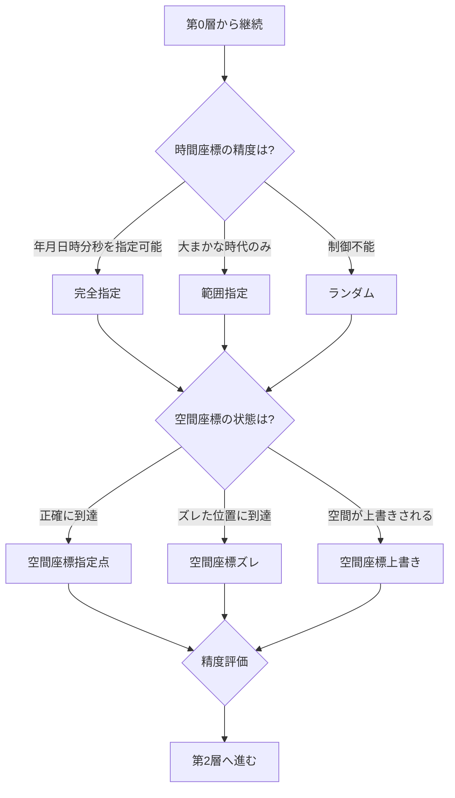

## 第4章：第1層 - 時空座標条件

### 4-1. 概要

第1層は、時間旅行における「いつ」「どこに」到達するかの精度を判定する。時間座標と空間座標の両方を扱う。

|項目|内容|
|---|---|
|層名|第1層：時空座標条件|
|英語名|Spacetime Coordinate Conditions|
|カテゴリ数|2|
|用語数|7|
|役割|到達地点の精度を判定する|

---

### 4-2. カテゴリ構成

|カテゴリ|用語数|内容|
|---|---|---|
|時間座標精度|4|いつに到達するかの精度|
|空間座標|3|どこに到達するかの状態|

---

### 4-3. 時間座標精度（Time Coordinate Precision）

|用語|英語|定義|
|---|---|---|
|時間座標点|Time Point|特定の瞬間を指す時間上の座標|
|完全指定|Full Designation|年月日時分秒を正確に指定して到達可能な状態|
|範囲指定|Range Designation|大まかな時代・期間のみ指定可能な状態|
|ランダム|Random|到達時点を制御できない状態|

---

### 4-4. 空間座標（Spatial Coordinate）

| 用語      | 英語                        | 定義                                 |
| ------- | ------------------------- | ---------------------------------- |
| 空間座標指定点 | Spatial Point Designation | 目的の空間座標に正確に到達する状態                  |
| 空間座標ズレ  | Spatial Deviation         | 目的地からズレた位置に到達する状態                  |
| 空間座標上書き | Spatial Displacement      | 到達地点に既存の物体・空間状態が存在する場合、それが上書きされる状態 |

---

### 4-5. 時空座標の組み合わせマトリクス

|時間座標|空間座標|精度評価|パラドックス発生可能性|
|---|---|---|---|
|完全指定|指定点|最高|高（狙った介入が可能）|
|完全指定|ズレ|高|中（時間は正確だが場所が不確実）|
|完全指定|上書き|高|高（空間への影響あり）|
|範囲指定|指定点|中|中（時間が不確実）|
|範囲指定|ズレ|低|低（両方が不確実）|
|範囲指定|上書き|中|中（空間への影響あり）|
|ランダム|指定点|低|低（制御不能）|
|ランダム|ズレ|最低|最低（完全に制御不能）|
|ランダム|上書き|低|低（予測不能な影響）|

---

### 4-6. 判定フロー

---

### 4-7. 第1層の判定結果が与える影響

|時間座標精度|後続層への影響|
|---|---|
|完全指定|特定の人物・事象への介入が可能、パラドックスリスク増大|
|範囲指定|目的達成が困難、偶発的な影響が発生しうる|
|ランダム|制御不能、意図したパラドックスは発生しにくい|

|空間座標|後続層への影響|
|---|---|
|指定点|目的地での行動が可能|
|ズレ|目的達成に追加行動が必要|
|上書き|空間そのものへの影響、物理法則系の問題が発生しうる|

---
