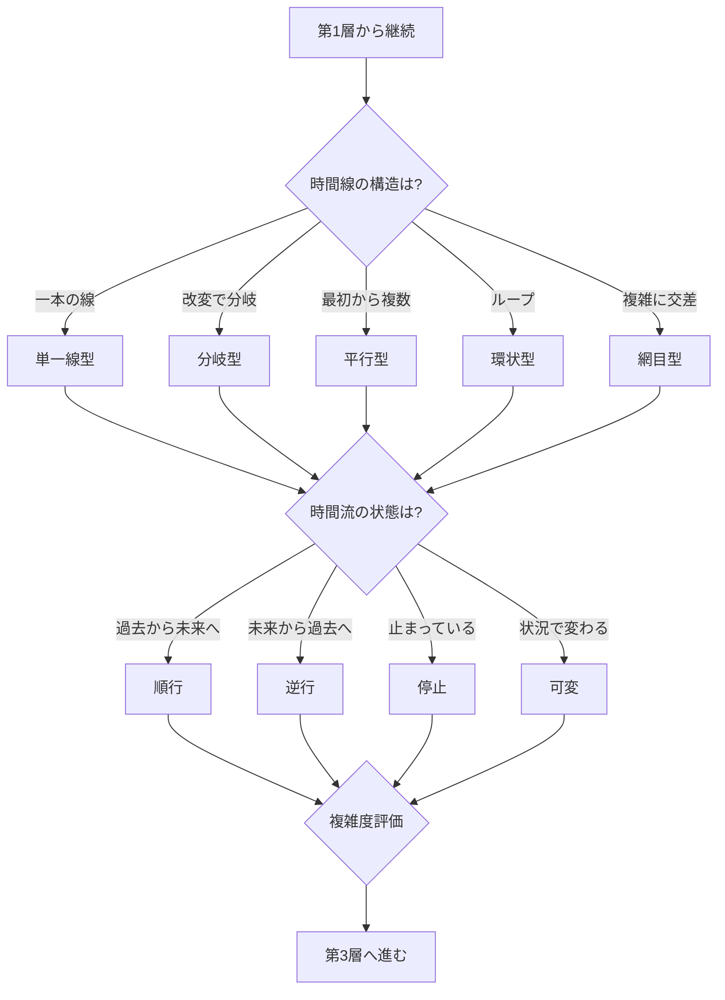

## 第5章：第2層 - 時間線・時間流条件

### 5-1. 概要

第2層は、時間旅行先の時間構造と時間の流れを判定する。時間線がどのような構造を持ち、時間流がどの方向・速度で流れているかを特定する。

|項目|内容|
|---|---|
|層名|第2層：時間線・時間流条件|
|英語名|Timeline and Timeflow Conditions|
|カテゴリ数|2|
|用語数|11|
|役割|時間の構造と流れの状態を判定する|

---

### 5-2. カテゴリ構成

|カテゴリ|用語数|内容|
|---|---|---|
|時間線構造|6|時間がどのような構造を持つか|
|時間流状態|5|時間がどの方向・速度で流れているか|

---

### 5-3. 時間線構造（Timeline Structure）

| 用語   | 英語          | 定義                          |
| ---- | ----------- | --------------------------- |
| 時間線  | Timeline    | 出来事が連なる線としての時間の構造           |
| 単一線型 | Single-line | 一本の線として時間が存在し改変で歴史が上書きされる構造 |
| 分岐型  | Branching   | 改変により新しい時間線が分岐する構造          |
| 平行型  | Parallel    | 最初から複数の時間線が並行して存在する構造       |
| 環状型  | Circular    | 始点と終点が繋がったループ構造             |
| 網目型  | Network     | 複数の時間線が複雑に交差する構造            |

---

### 5-4. 時間線構造の特性比較

|構造|歴史改変時の挙動|パラドックスリスク|帰還への影響|
|---|---|---|---|
|単一線型|歴史が上書きされる|最高|元の歴史に戻れない可能性|
|分岐型|新しい時間線が生成|低（自分の過去は無傷）|元の時間線に戻れる可能性|
|平行型|別の時間線に移動|最低|元の時間線を見つける必要|
|環状型|ループ内で自己無撞着|中（ループ整合性が必要）|ループを抜けられるか|
|網目型|交差点で複雑な影響|高（予測困難）|経路が複数存在|

---

### 5-5. 時間流状態（Timeflow State）

| 用語  | 英語       | 定義                 |
| --- | -------- | ------------------ |
| 時間流 | Timeflow | 時間が流れる方向と速度        |
| 順行  | Forward  | 過去から未来へ正方向に流れている状態 |
| 逆行  | Backward | 未来から過去へ逆方向に流れている状態 |
| 停止  | Stasis   | 時間の流れが止まっている状態     |
| 可変  | Variable | 場所や状況により流速が変化する状態  |

---

### 5-6. 時間流状態の特性比較

|状態|滞在中の時間経過|旅行者への影響|特殊な問題|
|---|---|---|---|
|順行|通常通り進む|老化が進む|なし|
|逆行|逆方向に進む|若返る可能性|因果の逆転|
|停止|進まない|老化しない|行動が不可能な場合あり|
|可変|状況で変わる|予測困難|相対性効果との関連|

---

### 5-7. 時間線構造と時間流状態の組み合わせ

|時間線構造|時間流状態|複雑度|主な問題|
|---|---|---|---|
|単一線型|順行|低|歴史上書きによる矛盾|
|単一線型|逆行|高|因果逆転と歴史上書きの複合|
|分岐型|順行|中|分岐先の特定|
|分岐型|逆行|高|分岐と逆行の複合|
|平行型|順行|低|時間線間の移動|
|環状型|順行|中|ループの自己無撞着性|
|環状型|逆行|最高|ループ内での因果逆転|
|網目型|可変|最高|予測不能な複雑性|

---

### 5-8. 判定フロー

---

### 5-9. 第2層の判定結果が与える影響

|時間線構造|第4層（因果状態）への影響|
|---|---|
|単一線型|原因矛盾・結果矛盾が直接発生|
|分岐型|矛盾は別時間線で処理される|
|平行型|自分の時間線には影響なし|
|環状型|自己無撞着な因果のみ存在可能|
|網目型|複数の因果が交差し予測困難|

|時間流状態|第5層（観測・認識）への影響|
|---|---|
|順行|通常の観測・記憶形成|
|逆行|記憶の逆行・改竄リスク|
|停止|観測不能の可能性|
|可変|記憶の連続性に影響|

---
