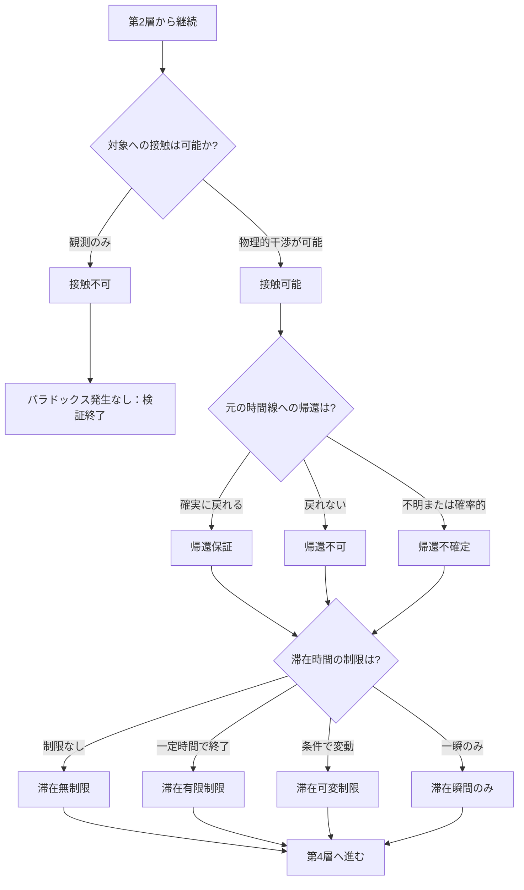

## 第6章：第3層 - 移動制約条件

### 6-1. 概要

第3層は、時間旅行における物理的・技術的な制約を判定する。対象への接触、元の時間線への帰還、滞在可能時間の3つの制約を扱う。

|項目|内容|
|---|---|
|層名|第3層：移動制約条件|
|英語名|Movement Constraint Conditions|
|カテゴリ数|3|
|用語数|9|
|役割|移動に関する制約を判定する|

---

### 6-2. カテゴリ構成

|カテゴリ|用語数|内容|
|---|---|---|
|接触可能性|2|対象に物理的干渉が可能か|
|帰還可能性|3|元の時間線に戻れるか|
|滞在時間制限|4|どれだけ滞在できるか|

---

### 6-3. 接触可能性（Contact Possibility）

|用語|英語|定義|
|---|---|---|
|接触可能|Contactable|過去または未来の人物・物体に物理的干渉が可能な状態|
|接触不可|Non-contactable|観測のみ可能で物理的干渉は不可能な状態|

---

### 6-4. 接触可能性の影響

|状態|パラドックスリスク|可能な行動|歴史への影響|
|---|---|---|---|
|接触可能|高|介入、改変、対話、破壊|直接的な影響あり|
|接触不可|なし|観測のみ|影響なし|

---

### 6-5. 帰還可能性（Return Possibility）

|用語|英語|定義|
|---|---|---|
|帰還保証|Guaranteed Return|元の時間線・時点への帰還が確実な状態|
|帰還不可|Impossible Return|帰還手段がなく片道のみの状態|
|帰還不確定|Uncertain Return|帰還できるかどうか不明または確率的な状態|

---

### 6-6. 帰還可能性の影響

|状態|情報の持ち帰り|旅行者の運命|パラドックスへの影響|
|---|---|---|---|
|帰還保証|可能|元の時間に戻る|情報パラドックスのリスク|
|帰還不可|不可能|移動先に永住|元の時間線への影響は限定的|
|帰還不確定|不確実|不明|予測困難|

---

### 6-7. 滞在時間制限（Duration Limit）

| 用語     | 英語                 | 定義                  |
| ------ | ------------------ | ------------------- |
| 滞在無制限  | Unlimited Stay     | 滞在時間に制限がない状態        |
| 滞在有限制限 | Limited Stay       | 一定時間で強制帰還または消滅する状態  |
| 滞在可変制限 | Variable Stay      | 条件によって滞在可能時間が変動する状態 |
| 滞在瞬間のみ | Instantaneous Stay | 一瞬しか滞在できない状態        |

---

### 6-8. 滞在時間制限の影響

|状態|可能な行動範囲|パラドックスリスク|特殊な問題|
|---|---|---|---|
|滞在無制限|最大|最高|長期滞在による複合的影響|
|滞在有限制限|制限内|中|時間切れによる強制終了|
|滞在可変制限|不確定|中|条件把握が必要|
|滞在瞬間のみ|最小|低|観測程度しかできない|

---

### 6-9. 制約条件の組み合わせマトリクス

|接触|帰還|滞在|総合リスク|典型的なシナリオ|
|---|---|---|---|---|
|可能|保証|無制限|最高|完全な時間旅行、最大の自由度|
|可能|保証|有限|高|制限時間内のミッション|
|可能|保証|瞬間|中|瞬間的な介入|
|可能|不可|無制限|高|片道移住型|
|可能|不可|有限|中|制限時間後に消滅|
|可能|不確定|可変|高|不確実な冒険|
|不可|保証|無制限|なし|観測専用、幽霊型|
|不可|保証|瞬間|なし|瞬間観測のみ|
|不可|不可|無制限|なし|観測専用の永住|

---

### 6-10. 判定フロー

---

### 6-11. 第3層の判定結果が与える影響

|接触可能性|後続層への影響|
|---|---|
|接触可能|第4層〜第6層の全判定が必要|
|接触不可|パラドックス発生なし、観測結果のみ検討|

|帰還可能性|後続層への影響|
|---|---|
|帰還保証|情報持ち帰りによる第6層への影響|
|帰還不可|元の時間線への影響は限定的|
|帰還不確定|全ての可能性を考慮する必要あり|

|滞在時間制限|後続層への影響|
|---|---|
|滞在無制限|長期的な因果への影響を考慮|
|滞在有限制限|制限時間内の影響を考慮|
|滞在可変制限|条件変動による影響を考慮|
|滞在瞬間のみ|影響は最小限|

---
