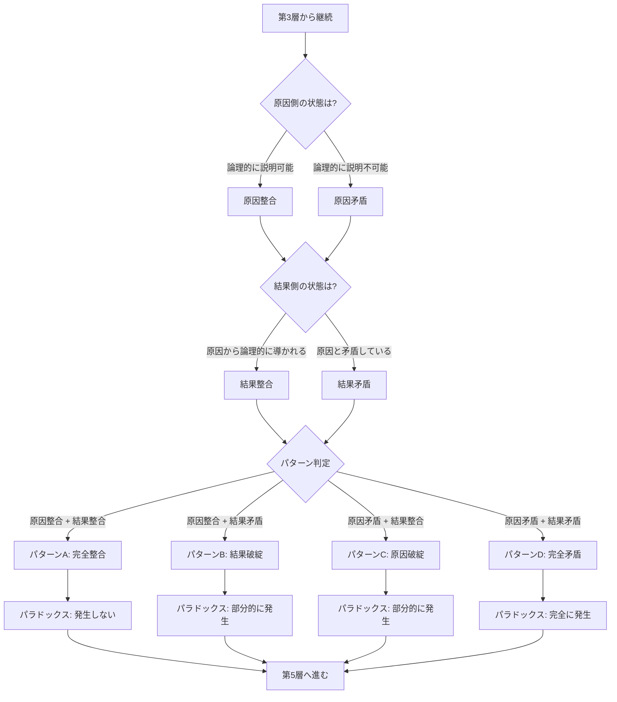

## 第7章：第4層 - 因果状態判定

### 7-1. 概要

第4層は、時間旅行後の因果関係における矛盾と整合を判定する。原因側と結果側それぞれの状態を評価し、総合的な時間矛盾/整合パターンを特定する。

|項目|内容|
|---|---|
|層名|第4層：因果状態判定|
|英語名|Causal State Judgment|
|カテゴリ数|3|
|用語数|10|
|役割|因果関係の矛盾と整合を判定する|

---

### 7-2. カテゴリ構成

|カテゴリ|用語数|内容|
|---|---|---|
|原因矛盾/整合|2|原因側の状態|
|結果矛盾/整合|2|結果側の状態|
|時間矛盾/整合|6|総合的な判定パターン|

---

### 7-3. 原因矛盾/整合（Cause Contradiction/Alignment）

|用語|英語|定義|
|---|---|---|
|原因整合|Cause Alignment|原因側で論理的整合が保たれている状態|
|原因矛盾|Cause Contradiction|原因側で論理的矛盾が発生している状態|

---

### 7-4. 原因矛盾/整合の判定基準

|状態|判定基準|例|
|---|---|---|
|原因整合|原因が明確に存在し、論理的に説明可能|旅行者が過去に行った動機が明確|
|原因矛盾|原因が存在しない、または論理的に説明不可能|旅行者を生んだ祖父が存在しない|

---

### 7-5. 結果矛盾/整合（Effect Contradiction/Alignment）

|用語|英語|定義|
|---|---|---|
|結果整合|Effect Alignment|結果側で論理的整合が保たれている状態|
|結果矛盾|Effect Contradiction|結果側で論理的矛盾が発生している状態|

---

### 7-6. 結果矛盾/整合の判定基準

|状態|判定基準|例|
|---|---|---|
|結果整合|結果が原因から論理的に導かれる|介入により歴史が変化した|
|結果矛盾|結果が原因と矛盾している|介入したのに何も変わっていない|

---

### 7-7. 時間矛盾/整合（Time Contradiction/Alignment）

| 用語   | 英語                 | 定義                                        |
| ---- | ------------------ | ----------------------------------------- |
| 時間整合 | Alignment Time     | 時間旅行後も論理的整合性が保たれている状態※英語表記は本フレームワーク独自の語順  |
| 時間矛盾 | Contradiction Time | 時間旅行によって論理的矛盾が発生している状態※英語表記は本フレームワーク独自の語順 |
| 完全整合 | Full Alignment     | 原因・結果ともに整合している状態（パターンA）                   |
| 結果破綻 | Effect Breakdown   | 原因は整合だが結果が矛盾している状態（パターンB）                 |
| 原因破綻 | Cause Breakdown    | 原因は矛盾だが結果が整合している状態（パターンC）                 |
| 完全矛盾 | Full Contradiction | 原因・結果ともに矛盾している状態（パターンD）                   |

---

### 7-8. 時間矛盾/整合パターンマトリクス

|パターン|原因|結果|状態名|パラドックス|
|---|---|---|---|---|
|A|整合|整合|完全整合|発生しない|
|B|整合|矛盾|結果破綻|部分的に発生|
|C|矛盾|整合|原因破綻|部分的に発生|
|D|矛盾|矛盾|完全矛盾|完全に発生|

---

### 7-9. 各パターンの具体例

|パターン|具体例|
|---|---|
|A（完全整合）|過去に行って何も変えず戻った。因果関係は完全に維持されている|
|B（結果破綻）|正当な動機で過去に行ったが、介入の結果がありえない形で現れた|
|C（原因破綻）|存在しないはずの原因から、正当な結果が発生した（ブートストラップ系）|
|D（完全矛盾）|祖父を殺したのに自分が存在し、その自分が祖父を殺している|

---

### 7-10. 判定フロー

---

### 7-11. 第4層の判定結果が与える影響

|パターン|第5層（観測・認識）への影響|第6層（存在・情報）への影響|
|---|---|---|
|A（完全整合）|通常の観測・記憶形成|存在・情報に問題なし|
|B（結果破綻）|結果の認識に混乱が生じる可能性|情報の整合性に問題|
|C（原因破綻）|原因の記憶に問題が生じる可能性|存在の起源に問題|
|D（完全矛盾）|観測・記憶の両方に深刻な問題|存在・情報の両方に深刻な問題|

---
