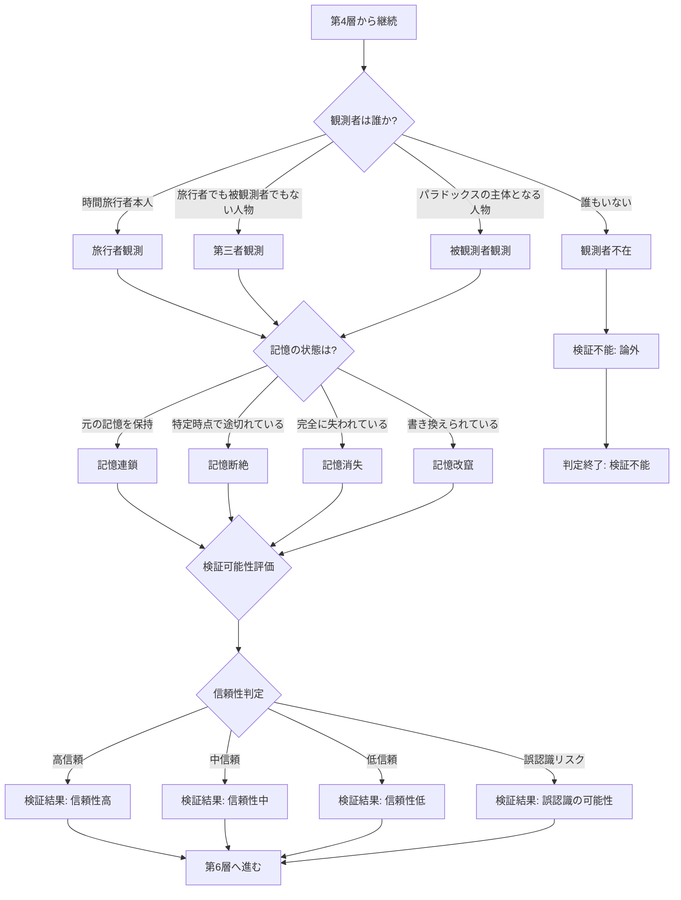

## 第8章：第5層 - 観測・認識判定

### 8-1. 概要

第5層は、時間旅行における観測者の問題と記憶の連続性を判定する。誰が矛盾/整合を認識するのか、記憶はどのような状態にあるのかを特定する。

|項目|内容|
|---|---|
|層名|第5層：観測・認識判定|
|英語名|Observation and Recognition Judgment|
|カテゴリ数|2|
|用語数|9|
|役割|観測者と記憶の状態を判定する|

---

### 8-2. カテゴリ構成

|カテゴリ|用語数|内容|
|---|---|---|
|観測者問題|5|誰が矛盾/整合を認識するか|
|記憶の連続性|4|記憶がどのような状態にあるか|

---

### 8-3. 観測者問題（Observer Problem）

| 用語     | 英語                      | 定義                             |
| ------ | ----------------------- | ------------------------------ |
| 観測者    | Observer                | 時間矛盾/整合を認識する主体                 |
| 旅行者観測  | Traveler Observation    | 時間旅行を実行した当事者が観測すること            |
| 第三者観測  | Third-party Observation | 旅行者でも被観測者でもない人物が観測すること         |
| 被観測者観測 | Subject Observation     | パラドックスの主体となる人物（介入対象者）が自ら観測すること |
| 観測者不在  | No Observer             | 上記いずれにも該当せず検証不能な状態             |

---

### 8-4. 観測者の種類と特性

|観測者|特性|観測可能な内容|信頼性|
|---|---|---|---|
|旅行者|両時間線の記憶を持つ可能性|変化前と変化後の差異|高（直接体験）|
|第三者|一方の時間線の記憶のみ|現在の状態のみ|中（間接的）|
|被観測者|介入の対象となった人物|自身への影響|中（主観的）|
|不在|誰も認識しない|なし|検証不能|

---

### 8-5. 観測者の有効性判定

|判定|条件|結果|
|---|---|---|
|有効|旅行者、第三者、被観測者のいずれかが存在|検証可能|
|無効|いずれも存在しない|検証不能（論外）|

---

### 8-6. 記憶の連続性（Memory Continuity）

|用語|英語|定義|
|---|---|---|
|記憶連鎖|Memory Chain|元の時間線の記憶を保持したまま連続している状態|
|記憶断絶|Memory Severance|特定時点で記憶が途切れている状態|
|記憶消失|Memory Loss|記憶が完全に失われている状態|
|記憶改竄|Memory Falsification|記憶が書き換えられている状態|

---

### 8-7. 記憶の連続性と影響

|状態|旅行者への影響|パラドックス認識|特殊な問題|
|---|---|---|---|
|記憶連鎖|両時間線を記憶|差異を認識可能|二重記憶による混乱|
|記憶断絶|一部が欠落|部分的に認識可能|欠落部分の補完不能|
|記憶消失|全て失われる|認識不能|アイデンティティ喪失|
|記憶改竄|偽の記憶を持つ|誤認識の危険|真実との乖離|

---

### 8-8. 観測者と記憶の組み合わせマトリクス

|観測者|記憶状態|検証可能性|信頼性|
|---|---|---|---|
|旅行者|記憶連鎖|最高|最高|
|旅行者|記憶断絶|高|中|
|旅行者|記憶消失|低|低|
|旅行者|記憶改竄|中|最低（誤認識リスク）|
|第三者|記憶連鎖|高|高|
|第三者|記憶断絶|中|中|
|第三者|記憶消失|低|低|
|第三者|記憶改竄|中|低|
|被観測者|記憶連鎖|高|中（主観的）|
|被観測者|記憶断絶|中|低|
|被観測者|記憶消失|低|最低|
|被観測者|記憶改竄|中|最低|
|不在|任意|なし|検証不能|

---

### 8-9. 判定フロー

---

### 8-10. 第5層の判定結果が与える影響

|観測者|第6層（存在・情報）への影響|
|---|---|
|旅行者観測|同時存在の認識が可能、情報劣化の検出が可能|
|第三者観測|外部からの客観的な存在確認が可能|
|被観測者観測|自身の存在状態を主観的に認識|
|観測者不在|第6層の判定も検証不能|

|記憶状態|第6層（存在・情報）への影響|
|---|---|
|記憶連鎖|情報の完全性を確認可能|
|記憶断絶|情報の部分的な欠損を認識|
|記憶消失|情報の完全劣化と同等|
|記憶改竄|情報ノイズ混入と同等の問題|

---
