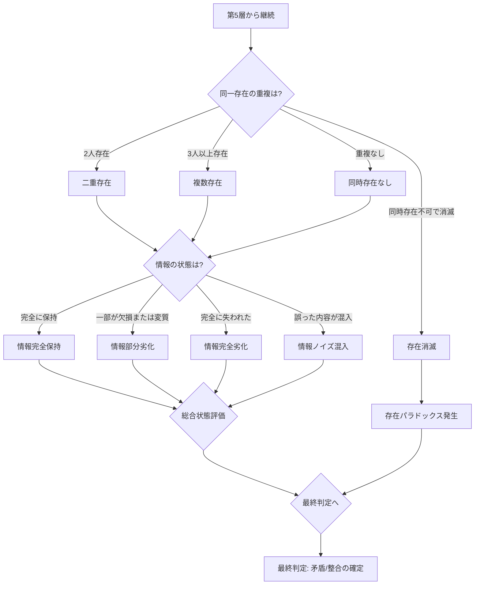

## 第9章：第6層 - 存在・情報判定

### 9-1. 概要

第6層は、時間旅行における存在の重複問題と情報の劣化を判定する。同一人物や物体が複数存在する状態、および時間移動に伴う情報の変質を特定する。

|項目|内容|
|---|---|
|層名|第6層：存在・情報判定|
|英語名|Existence and Information Judgment|
|カテゴリ数|2|
|用語数|7|
|役割|存在と情報の状態を判定する|

---

### 9-2. カテゴリ構成

|カテゴリ|用語数|内容|
|---|---|---|
|同時存在問題|3|同一存在が複数いる状態|
|情報劣化|4|情報の変質状態|

---

### 9-3. 同時存在問題（Simultaneous Existence）

| 用語   | 英語                     | 定義                  |
| ---- | ---------------------- | ------------------- |
| 二重存在 | Dual Existence         | 同一人物が2人同時に存在する状態    |
| 複数存在 | Multiple Existence     | 同一人物が3人以上同時に存在する状態  |
| 存在消滅 | Existence Annihilation | 同時存在が物理的に不可能で消滅する状態 |

---

### 9-4. 同時存在の発生条件

| 状態   | 発生条件            | 例                  |
| ---- | --------------- | ------------------ |
| 二重存在 | 過去の自分がいる時点に到達   | 10年前に行き、当時の自分と遭遇   |
| 複数存在 | 同一時点に複数回訪問      | 同じ日に3回訪問し、3人の自分が存在 |
| 存在消滅 | 物理法則が同時存在を許容しない | 接触した瞬間に対消滅         |

---

### 9-5. 同時存在の影響

| 状態   | 物理的影響   | 因果への影響    | パラドックスリスク    |
| ---- | ------- | --------- | ------------ |
| 二重存在 | 質量の重複   | 自己への干渉が可能 | 高            |
| 複数存在 | 質量の多重重複 | 複雑な自己干渉   | 最高           |
| 存在消滅 | 質量の消失   | 存在自体の否定   | 最高（存在パラドックス） |

---

### 9-6. 同時存在と接触の関係

| 同時存在 | 接触した場合                 | 接触しない場合   |
| ---- | ---------------------- | --------- |
| 二重存在 | 情報交換・干渉が可能、パラドックスリスク増大 | 観測のみ、リスク低 |
| 複数存在 | 複雑な情報交換、予測困難な結果        | 複数の自己観測   |
| 存在消滅 | 消滅が発生                  | 接触前に回避必要  |

---

### 9-7. 情報劣化（Information Degradation）

|用語|英語|定義|
|---|---|---|
|情報完全保持|Full Information Retention|情報が劣化せず完全に保持される状態|
|情報部分劣化|Partial Information Degradation|情報の一部が欠損または変質する状態|
|情報完全劣化|Full Information Degradation|情報が完全に失われるまたは使用不能な状態|
|情報ノイズ混入|Information Noise Contamination|情報に誤った内容が混入する状態|

---

### 9-8. 情報劣化の発生要因

|状態|発生要因|例|
|---|---|---|
|情報完全保持|理想的な時間移動|全ての記憶・データが保持される|
|情報部分劣化|時間移動の不完全性|一部の記録が読み取れなくなる|
|情報完全劣化|時間移動の重大なエラー|全てのデータが消失|
|情報ノイズ混入|時間線間の干渉|別の時間線の情報が混入|

---

### 9-9. 情報劣化の影響

|状態|検証への影響|パラドックス認識への影響|
|---|---|---|
|情報完全保持|完全な検証が可能|正確な認識が可能|
|情報部分劣化|部分的な検証のみ可能|不完全な認識|
|情報完全劣化|検証不能|認識不能|
|情報ノイズ混入|誤った検証結果のリスク|誤認識のリスク|

---

### 9-10. 同時存在と情報劣化の組み合わせマトリクス

| 同時存在 | 情報劣化  | 総合状態    | 検証可能性     |
| ---- | ----- | ------- | --------- |
| 二重存在 | 完全保持  | 安定      | 最高        |
| 二重存在 | 部分劣化  | やや不安定   | 高         |
| 二重存在 | 完全劣化  | 不安定     | 低         |
| 二重存在 | ノイズ混入 | 危険      | 中（誤認識リスク） |
| 複数存在 | 完全保持  | 複雑だが安定  | 高         |
| 複数存在 | 部分劣化  | 複雑かつ不安定 | 中         |
| 複数存在 | 完全劣化  | 非常に不安定  | 低         |
| 複数存在 | ノイズ混入 | 非常に危険   | 最低        |
| 存在消滅 | 任意    | 存在自体が消滅 | 検証不能      |

---

### 9-11. 判定フロー

---

### 9-12. 第6層の判定結果と最終判定への影響

| 同時存在 | 情報劣化  | 最終判定への影響    |
| ---- | ----- | ----------- |
| なし   | 完全保持  | 完全整合の可能性が高い |
| 二重存在 | 完全保持  | 部分矛盾の可能性    |
| 二重存在 | 部分劣化  | 部分矛盾の可能性が高い |
| 複数存在 | 任意    | 完全矛盾の可能性が高い |
| 存在消滅 | 任意    | 完全矛盾が確定     |
| 任意   | 完全劣化  | 検証不能        |
| 任意   | ノイズ混入 | 誤判定のリスク     |

---

### 9-13. 最終判定への移行

第6層の判定が完了した時点で、全層の結果を統合し、最終判定を行う。

|最終判定|条件|
|---|---|
|完全整合|全層で矛盾が発生していない|
|部分矛盾|一部の層で矛盾が発生しているが、他は整合|
|完全矛盾|複数の層で矛盾が発生、またはパターンDが確定|
|検証不能|観測者不在、情報完全劣化、存在消滅のいずれかに該当|

---
