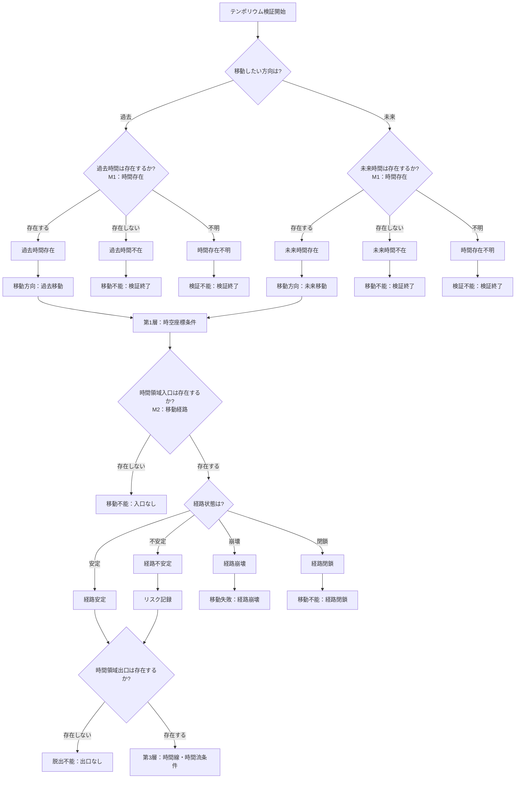
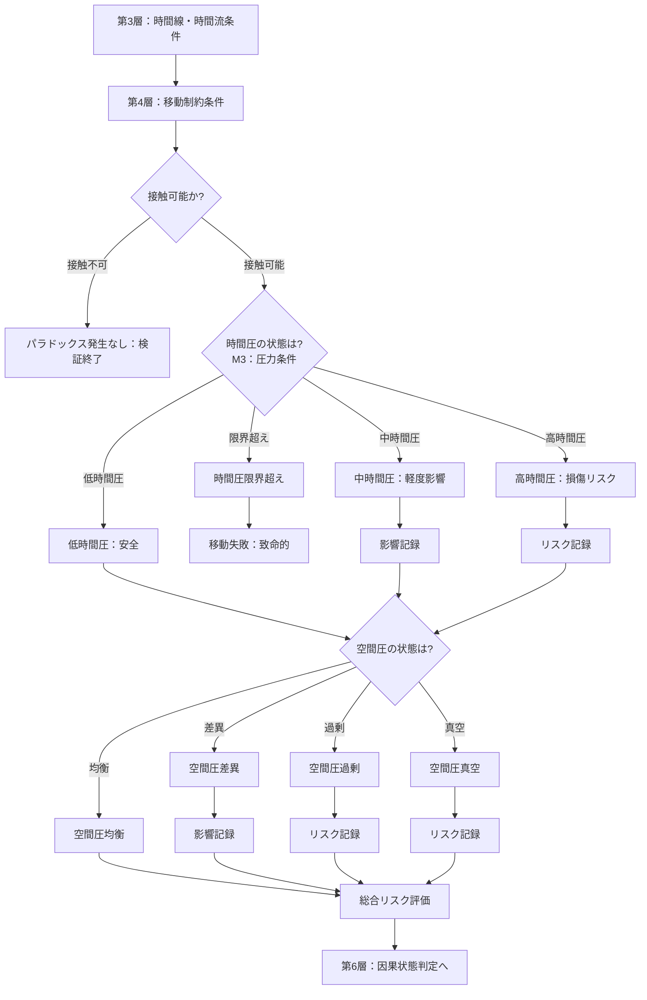
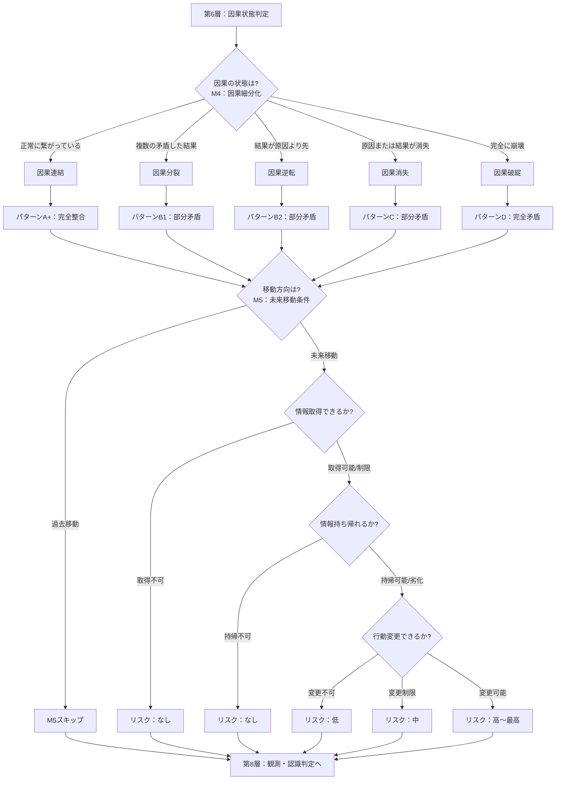
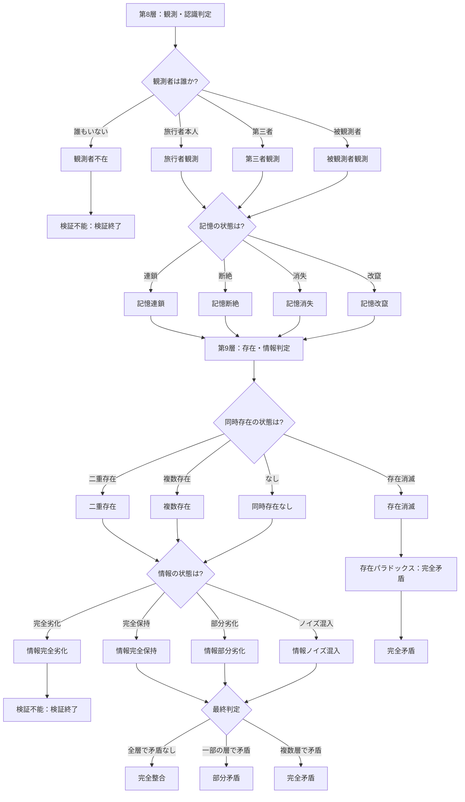

---

## 付録A：統合フローチャート

---
## 付録A：統合フローチャート

### A-1. 概要

本付録では、全モジュール適用時の統合フローチャートを提示する。

Ver.1.0の判定フローに全5モジュールを組み込んだ場合の完全版フローである。

---

### A-2. 全体構成

|区分|層|内容|
|---|---|---|
|移動条件群|第0層〜第5層|時間旅行の物理的・技術的条件|
|状態判定群|第6層〜第9層|時間旅行後の論理的・認識的状態|

---

### A-3. 第0層〜第2層：移動開始フロー

---

### A-4. 第3層〜第5層：移動制約・圧力フロー

---

### A-5. 第6層〜第7層：因果・未来移動フロー

---

### A-6. 第8層〜第9層：観測・存在・最終判定フロー

---

### A-7. 検証終了ポイント一覧

|層|条件|結果|
|---|---|---|
|第0層|過去時間不在|移動不能|
|第0層|未来時間不在|移動不能|
|第0層|時間存在不明|検証不能|
|第2層|入口不在|移動不能|
|第2層|経路崩壊|移動失敗|
|第2層|経路閉鎖|移動不能|
|第2層|出口不在|脱出不能|
|第4層|接触不可|パラドックス発生なし|
|第5層|時間圧限界超え|移動失敗（致命的）|
|第8層|観測者不在|検証不能|
|第9層|存在消滅|完全矛盾|
|第9層|情報完全劣化|検証不能|

---

### A-8. 最終判定サマリ

|判定|条件|結果|
|---|---|---|
|完全整合|全層で矛盾なし|パラドックスは発生しない|
|部分矛盾|一部の層で矛盾|条件付きでパラドックスが発生|
|完全矛盾|複数層で矛盾、パターンD、存在消滅|パラドックスが完全に成立|
|検証不能|時間存在不明、観測者不在、情報完全劣化|判定自体が不可能|
|移動不能|時間不在、入口不在、経路閉鎖|時間移動が成立しない|
|移動失敗|経路崩壊、時間圧限界超え|移動中に失敗|
|発生なし|接触不可|干渉不能のためパラドックスなし|

---
