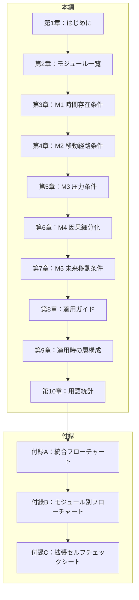

## 第1章：はじめに

### 1-1. 本資料の目的

本資料は、テンポリウム Ver.1.0 に対して任意で適用可能な拡張要素を、独立したモジュールとして整理・提供するものである。

Ver.1.0 本編の構造を維持したまま、必要に応じて判定精度を向上させることを目的とする。

---

### 1-2. 位置づけ

|項目|内容|
|---|---|
|資料名|テンポリウム 拡張モジュール集|
|対象|テンポリウム Ver.1.0|
|性質|任意適用の拡張要素（本編に統合しない）|
|適用方法|必要なモジュールのみを選択して適用|

---

### 1-3. Ver.1.0 との関係

|観点|説明|
|---|---|
|独立性|各モジュールは独立しており、単体でも複数でも適用可能|
|互換性|モジュール未適用時はVer.1.0と完全に同じ挙動|
|非破壊|Ver.1.0本編の層番号・用語定義は変更しない|
|拡張性|将来的なモジュール追加にも対応可能な設計|

---

### 1-4. 使用方法

| ステップ   | 内容                             |
| ------ | ------------------------------ |
| Step 1 | 第2章「モジュール一覧」で各モジュールの概要を確認する    |
| Step 2 | 第8章「適用ガイド」で適用すべきモジュールを選定する     |
| Step 3 | 該当モジュールの章（第3章〜第7章）を参照し、判定に組み込む |
| Step 4 | 付録C「拡張セルフチェックシート」を併用する         |

---

### 1-5. 注意事項

|項目|内容|
|---|---|
|検証状態|本資料のモジュールは検討段階であり、十分な適用テストを経ていない|
|仮説の混入|一部モジュール（M1・M3）は物理学的に未確立な概念を含む|
|複雑化リスク|全モジュール適用時は用語数が65→107に増加し、学習コストが上がる|
|推奨|まずはVer.1.0単体で運用し、必要性を感じた場合にモジュールを追加する|

---

### 1-6. 本資料の構成

---
