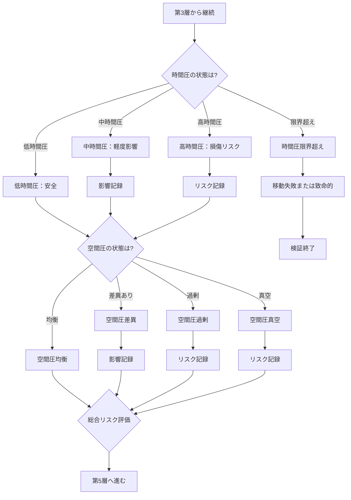

---

## 第5章：M3：圧力条件

---
## 第5章：M3：圧力条件

### 5-1. 概要

M3は、時間移動および空間存在における「負荷」を判定するモジュールである。

物理的な空間移動（飛行機の気圧変化、深海の水圧など）には圧力差が発生する。本モジュールでは、時間移動においても同様の負荷が発生すると想定し、その影響を検証対象に含める。

|項目|内容|
|---|---|
|モジュール名|M3：圧力条件|
|英語名|Pressure Conditions|
|適用タイプ|新層追加（第3層と第4層の間）|
|カテゴリ数|2|
|用語数|12|
|依存|M2（推奨）|

---

### 5-2. 適用による変化

|項目|Ver.1.0|M3適用後|
|---|---|---|
|層数|7層|8層|
|第4層|因果状態判定|圧力条件（新）|
|第5層|観測・認識判定|因果状態判定（繰り下げ）|
|以降の層|-|全て+1繰り下げ|

---

### 5-3. カテゴリ構成

|カテゴリ|用語数|内容|
|---|---|---|
|時間圧|6|タイムホール内でかかる負荷|
|空間圧|6|各空間座標点における存在負荷|

なお、時間圧係数および空間圧係数は、将来的に測定手法が確立された際に数値を代入するための枠として定義している。現時点では定量的な測定基準が存在しないため、本モジュールでは定性的分類（低・中・高等）で運用する。

---

### 5-4. 時間圧（Time Pressure）

|用語|英語|定義|
|---|---|---|
|時間圧|Time Pressure|時間領域内で旅行者にかかる負荷|
|時間圧係数|Time Pressure Coefficient|時間圧の度合いを示す値|
|低時間圧|Low Time Pressure|負荷が小さく安全に通過可能|
|中時間圧|Medium Time Pressure|一定の負荷があり影響を受ける可能性|
|高時間圧|High Time Pressure|負荷が大きく損傷リスクあり|
|時間圧限界|Time Pressure Threshold|これを超えると通過不能または致命的|

---

### 5-5. 空間圧（Spatial Pressure）

|用語|英語|定義|
|---|---|---|
|空間圧|Spatial Pressure|各空間座標点における存在負荷|
|空間圧係数|Spatial Pressure Coefficient|空間圧の度合いを示す値|
|空間圧均衡|Spatial Pressure Balance|出発地と到達地の空間圧が同等|
|空間圧差異|Spatial Pressure Differential|出発地と到達地の空間圧に差がある|
|空間圧過剰|Spatial Pressure Excess|空間圧が高すぎて存在に影響|
|空間圧真空|Spatial Pressure Vacuum|空間圧がゼロまたは極端に低い状態|

---

### 5-6. 時間圧の影響

|時間圧|通過可否|旅行者への影響|後続処理|
|---|---|---|---|
|低時間圧|可能|なし|空間圧判定へ|
|中時間圧|可能|軽度の影響（疲労等）|空間圧判定へ（影響記録）|
|高時間圧|可能（リスクあり）|損傷リスク|空間圧判定へ（リスク記録）|
|時間圧限界超え|不可|致命的|移動失敗：検証終了|

---

### 5-7. 空間圧の影響

|空間圧|存在可否|旅行者への影響|後続処理|
|---|---|---|---|
|空間圧均衡|可能|なし|第5層へ進む|
|空間圧差異|可能|適応が必要|第5層へ進む（影響記録）|
|空間圧過剰|困難|存在に影響|第5層へ進む（リスク記録）|
|空間圧真空|困難|存在に影響|第5層へ進む（リスク記録）|

---

### 5-8. 時間圧×空間圧マトリクス

|時間圧|空間圧|総合リスク|結果|
|---|---|---|---|
|低|均衡|最低|安全な移動|
|低|差異|低|到達後に適応必要|
|低|過剰/真空|中|到達後に影響あり|
|中|均衡|中|移動中に軽度影響|
|中|差異|中〜高|移動中・到達後に影響|
|中|過剰/真空|高|全過程で影響あり|
|高|均衡|高|移動中に損傷リスク|
|高|差異|最高|全過程で重大リスク|
|高|過剰/真空|最高|全過程で重大リスク|
|限界超え|任意|致命的|移動失敗または死亡|

---

### 5-9. 判定フロー

---

### 5-10. 圧力概念図

---

### 5-11. Ver.1.0との互換性

|条件|挙動|
|---|---|
|M3未適用時|Ver.1.0と同一（圧力は暗黙に「影響なし」と仮定）|
|M3適用・低時間圧＋均衡|Ver.1.0と同一の結果で後続層へ|
|M3適用・中/高時間圧|リスクを記録して後続層へ|
|M3適用・限界超え|移動失敗として検証終了|

---

### 5-12. M2（移動経路条件）との関係

|関係|内容|
|---|---|
|推奨併用|M3の時間圧はタイムホール内で発生するため、M2との併用を推奨|
|単独適用|M3単独でも適用可能。その場合、経路の存在は暗黙に仮定される|
|判定順序|M2（経路通過） → M3（圧力判定）の順で処理|

---

### 5-13. 適用時の注意事項

|項目|内容|
|---|---|
|物理学的定義|時間圧・空間圧は理論上の概念であり、測定単位は未定義|
|仮説の混入|本モジュールは物理学的に未確立な概念を含む|
|検証終了の増加|時間圧限界超えで検証が終了するケースが増える|
|フィクションでの運用|作品世界の設定に応じて圧力レベルを定義すること|

---
