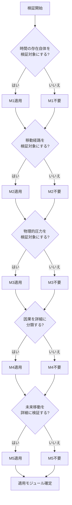

---

## 第8章：適用ガイド

---
## 第8章：適用ガイド

### 8-1. 概要

本章では、拡張モジュールの選択基準、組み合わせパターン、適用時の注意点を解説する。

目的に応じて適切なモジュールを選定するためのガイドラインを提供する。

---

### 8-2. モジュール選択基準

|目的|推奨モジュール|理由|
|---|---|---|
|哲学的議論を深めたい|M1|時間の存在自体を検証対象にできる|
|移動手段の整合性を検証したい|M2|経路の状態を判定対象にできる|
|物理的リスクを評価したい|M2 + M3|経路と圧力の両面から評価できる|
|パラドックスの種類を特定したい|M4|因果状態を詳細に分類できる|
|未来移動を詳細に検証したい|M1 + M5|未来の存在と情報の扱いを判定できる|
|最大限の検証精度が必要|全モジュール|全ての判定要素を網羅できる|

---

### 8-3. シナリオ別推奨パターン

|シナリオタイプ|推奨モジュール|理由|
|---|---|---|
|祖父殺し系|M4|因果消失パターンを明確に判定|
|ブートストラップ系|M4|因果逆転パターンを明確に判定|
|ワームホール移動系|M2 + M3|経路と圧力の物理的影響を判定|
|未来予知系|M5|情報取得・持帰・影響を判定|
|哲学的思考実験|M1|時間存在の前提を明示|
|ハードSF作品検証|M2 + M3|物理的な整合性を重視|
|ファンタジー作品検証|M4|因果の論理性を重視|
|全要素を含む複雑な作品|全モジュール|網羅的な検証が必要|

---

### 8-4. 組み合わせパターン

|パターン|モジュール|追加用語数|複雑度|用途|
|---|---|---|---|---|
|パターン0|なし（Ver.1.0のみ）|0|低|基本検証|
|パターン1|M1のみ|+5|低|哲学的検証|
|パターン2|M4のみ|+5|低|因果詳細分析|
|パターン3|M5のみ|+12|中|未来移動特化|
|パターン4|M2 + M3|+20|中|物理的検証|
|パターン5|M1 + M5|+17|中|未来移動完全版|
|パターン6|M1 + M4|+10|低|哲学＋因果|
|パターン7|M2 + M3 + M4|+25|高|物理＋因果|
|パターン8|全モジュール|+42|最高|完全検証|

---

### 8-5. 組み合わせ相性マトリクス

||M1|M2|M3|M4|M5|
|---|---|---|---|---|---|
|M1|-|○|○|○|◎|
|M2|○|-|◎|○|○|
|M3|○|◎|-|○|○|
|M4|○|○|○|-|○|
|M5|◎|○|○|○|-|

|記号|意味|
|---|---|
|◎|推奨併用（相乗効果あり）|
|○|併用可能（独立して機能）|

---

### 8-6. 適用時の層番号変化

|適用パターン|層数|層番号の変化|
|---|---|---|
|Ver.1.0のみ|7層|第0層〜第6層（変化なし）|
|M1のみ|7層|変化なし（第0層に統合）|
|M2のみ|8層|第2層以降が+1繰り下げ|
|M3のみ|8層|第4層以降が+1繰り下げ|
|M4のみ|7層|変化なし（第4層に統合）|
|M5のみ|8層|第5層以降が+1繰り下げ|
|M2 + M3|9層|第2層以降が+1、第5層以降がさらに+1|
|全モジュール|10層|第9章「適用時の層構成」参照|

---

### 8-7. 適用判断フロー

---

### 8-8. 段階的導入の推奨

|段階|内容|推奨モジュール|
|---|---|---|
|第1段階|Ver.1.0で基本検証に慣れる|なし|
|第2段階|因果の詳細分類を試す|M4|
|第3段階|哲学的前提を明示する|M1|
|第4段階|未来移動を詳細化する|M5|
|第5段階|物理的要素を追加する|M2 + M3|
|第6段階|全モジュールで完全検証|全モジュール|

---

### 8-9. 適用時の注意事項

|項目|内容|
|---|---|
|複雑化リスク|モジュール追加ごとに判定が複雑化する。必要最小限の適用を推奨|
|検証終了ポイントの増加|M1〜M3は新たな「検証終了」条件を追加する|
|層番号の混乱|複数モジュール適用時は層番号が変わるため、第9章の対応表を参照|
|仮説の混入|M1・M3は物理学的に未確立な概念を含む。検証結果の解釈に注意|
|互換性確保|モジュール未適用の判定結果とVer.1.0の結果は完全に一致する|

---

### 8-10. 適用判断チェックリスト

|No.|質問|はい→適用|いいえ→不要|
|---|---|---|---|
|1|過去・未来の存在自体を問いたいか？|M1|-|
|2|時間移動の経路（ワームホール等）を検証したいか？|M2|-|
|3|移動中・到達時の物理的負荷を検証したいか？|M3|-|
|4|パラドックスの種類を詳細に特定したいか？|M4|-|
|5|未来からの情報持ち帰りを検証したいか？|M5|-|
|6|シナリオは未来移動を含むか？|M5検討|M5不要|
|7|ハードSF的な物理整合性を求めるか？|M2 + M3|-|
|8|哲学的思考実験として扱うか？|M1|-|

---
