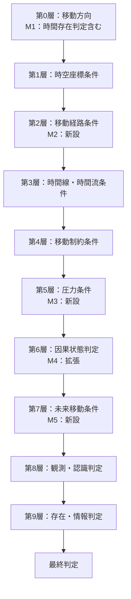

---

## 第9章：適用時の層構成

---
## 第9章：適用時の層構成

### 9-1. 概要

本章では、モジュール適用パターン別の層構成を一覧で提示する。

モジュールの組み合わせにより層番号が変化するため、適用時は本章を参照すること。

---

### 9-2. Ver.1.0（基準）

|層番号|層名|用語数|
|---|---|---|
|第0層|移動方向|2|
|第1層|時空座標条件|7|
|第2層|時間線・時間流条件|11|
|第3層|移動制約条件|9|
|第4層|因果状態判定|10|
|第5層|観測・認識判定|9|
|第6層|存在・情報判定|7|
|**合計**|**7層**|**55**|

---

### 9-3. M1のみ適用時

|層番号|層名|用語数|備考|
|---|---|---|---|
|第0層|移動方向（時間存在判定含む）|7|M1統合|
|第1層|時空座標条件|7||
|第2層|時間線・時間流条件|11||
|第3層|移動制約条件|9||
|第4層|因果状態判定|10||
|第5層|観測・認識判定|9||
|第6層|存在・情報判定|7||
|**合計**|**7層**|**60**|+5|

---

### 9-4. M2のみ適用時

|層番号|層名|用語数|備考|
|---|---|---|---|
|第0層|移動方向|2||
|第1層|時空座標条件|7||
|第2層|移動経路条件|8|M2新設|
|第3層|時間線・時間流条件|11|繰り下げ|
|第4層|移動制約条件|9|繰り下げ|
|第5層|因果状態判定|10|繰り下げ|
|第6層|観測・認識判定|9|繰り下げ|
|第7層|存在・情報判定|7|繰り下げ|
|**合計**|**8層**|**63**|+8|

---

### 9-5. M3のみ適用時

|層番号|層名|用語数|備考|
|---|---|---|---|
|第0層|移動方向|2||
|第1層|時空座標条件|7||
|第2層|時間線・時間流条件|11||
|第3層|移動制約条件|9||
|第4層|圧力条件|12|M3新設|
|第5層|因果状態判定|10|繰り下げ|
|第6層|観測・認識判定|9|繰り下げ|
|第7層|存在・情報判定|7|繰り下げ|
|**合計**|**8層**|**67**|+12|

---

### 9-6. M4のみ適用時

|層番号|層名|用語数|備考|
|---|---|---|---|
|第0層|移動方向|2||
|第1層|時空座標条件|7||
|第2層|時間線・時間流条件|11||
|第3層|移動制約条件|9||
|第4層|因果状態判定（拡張）|15|M4統合|
|第5層|観測・認識判定|9||
|第6層|存在・情報判定|7||
|**合計**|**7層**|**60**|+5|

---

### 9-7. M5のみ適用時

|層番号|層名|用語数|備考|
|---|---|---|---|
|第0層|移動方向|2||
|第1層|時空座標条件|7||
|第2層|時間線・時間流条件|11||
|第3層|移動制約条件|9||
|第4層|因果状態判定|10||
|第5層|未来移動条件|12|M5新設|
|第6層|観測・認識判定|9|繰り下げ|
|第7層|存在・情報判定|7|繰り下げ|
|**合計**|**8層**|**67**|+12|

---

### 9-8. M2 + M3 適用時

|層番号|層名|用語数|備考|
|---|---|---|---|
|第0層|移動方向|2||
|第1層|時空座標条件|7||
|第2層|移動経路条件|8|M2新設|
|第3層|時間線・時間流条件|11|繰り下げ|
|第4層|移動制約条件|9|繰り下げ|
|第5層|圧力条件|12|M3新設|
|第6層|因果状態判定|10|繰り下げ|
|第7層|観測・認識判定|9|繰り下げ|
|第8層|存在・情報判定|7|繰り下げ|
|**合計**|**9層**|**75**|+20|

---

### 9-9. M1 + M5 適用時

|層番号|層名|用語数|備考|
|---|---|---|---|
|第0層|移動方向（時間存在判定含む）|7|M1統合|
|第1層|時空座標条件|7||
|第2層|時間線・時間流条件|11||
|第3層|移動制約条件|9||
|第4層|因果状態判定|10||
|第5層|未来移動条件|12|M5新設|
|第6層|観測・認識判定|9|繰り下げ|
|第7層|存在・情報判定|7|繰り下げ|
|**合計**|**8層**|**72**|+17|

---

### 9-10. 全モジュール適用時

|層番号|層名|用語数|備考|
|---|---|---|---|
|第0層|移動方向（時間存在判定含む）|7|M1統合|
|第1層|時空座標条件|7||
|第2層|移動経路条件|8|M2新設|
|第3層|時間線・時間流条件|11|繰り下げ|
|第4層|移動制約条件|9|繰り下げ|
|第5層|圧力条件|12|M3新設|
|第6層|因果状態判定（拡張）|15|M4統合・繰り下げ|
|第7層|未来移動条件|12|M5新設|
|第8層|観測・認識判定|9|繰り下げ|
|第9層|存在・情報判定|7|繰り下げ|
|**合計**|**10層**|**97**|+42|

---

### 9-11. 層構成比較サマリ

|適用パターン|層数|用語数|増減|
|---|---|---|---|
|Ver.1.0のみ|7層|55|基準|
|M1のみ|7層|60|+5|
|M2のみ|8層|63|+8|
|M3のみ|8層|67|+12|
|M4のみ|7層|60|+5|
|M5のみ|8層|67|+12|
|M2 + M3|9層|75|+20|
|M1 + M5|8層|72|+17|
|全モジュール|10層|97|+42|

---

### 9-12. 層番号対応表

|Ver.1.0|M1|M2|M3|M4|M5|全適用|
|---|---|---|---|---|---|---|
|第0層|第0層|第0層|第0層|第0層|第0層|第0層|
|第1層|第1層|第1層|第1層|第1層|第1層|第1層|
|-|-|第2層(M2)|-|-|-|第2層(M2)|
|第2層|第2層|第3層|第2層|第2層|第2層|第3層|
|第3層|第3層|第4層|第3層|第3層|第3層|第4層|
|-|-|-|第4層(M3)|-|-|第5層(M3)|
|第4層|第4層|第5層|第5層|第4層|第4層|第6層|
|-|-|-|-|-|第5層(M5)|第7層(M5)|
|第5層|第5層|第6層|第6層|第5層|第6層|第8層|
|第6層|第6層|第7層|第7層|第6層|第7層|第9層|

---

### 9-13. 全モジュール適用時のフロー概要

---
