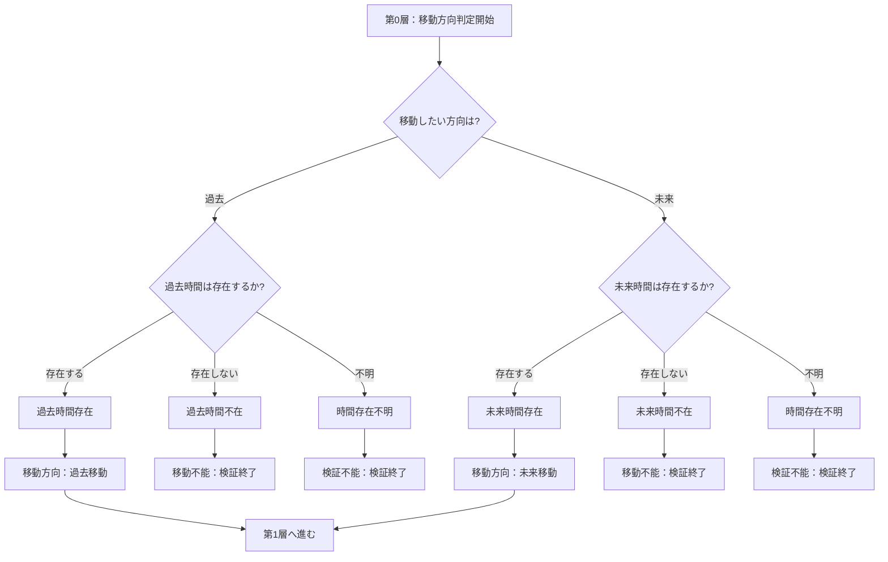
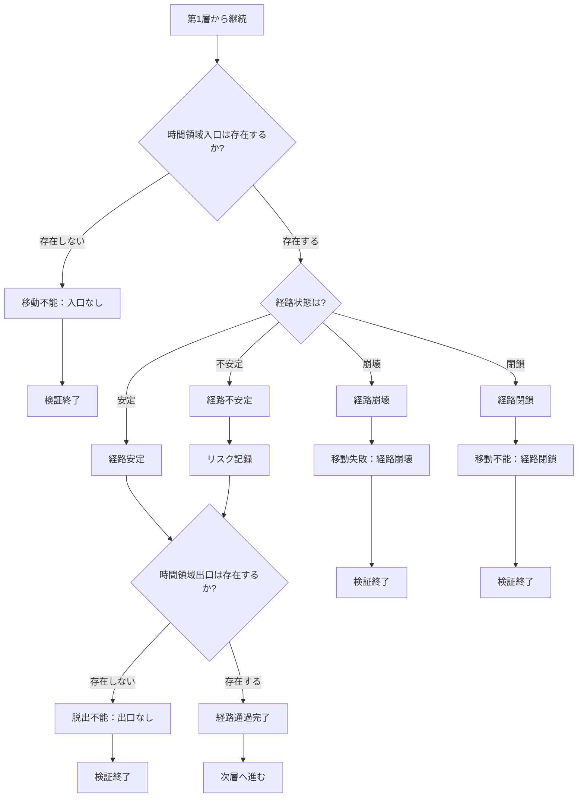
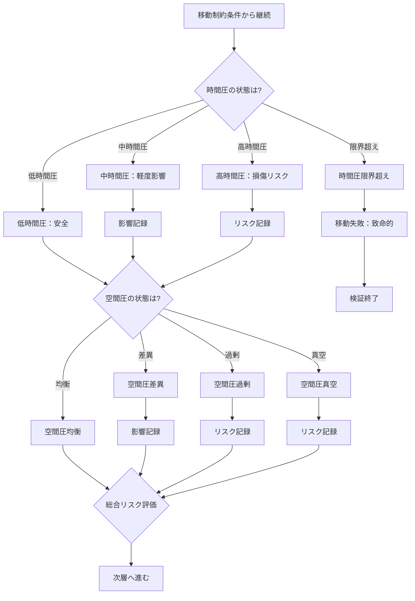
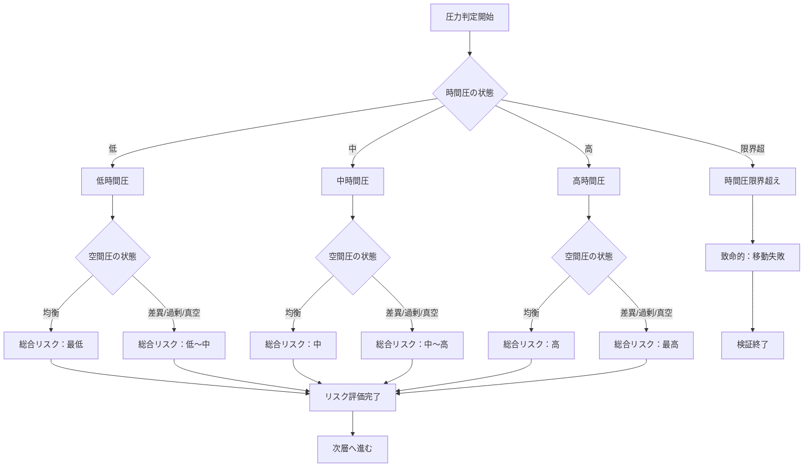
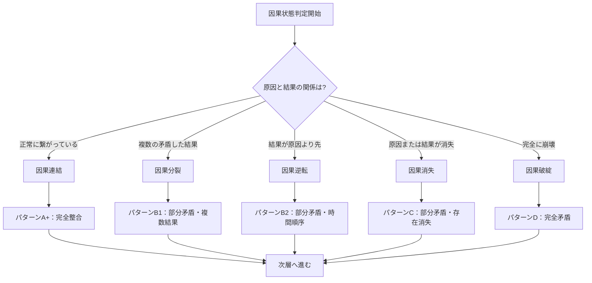
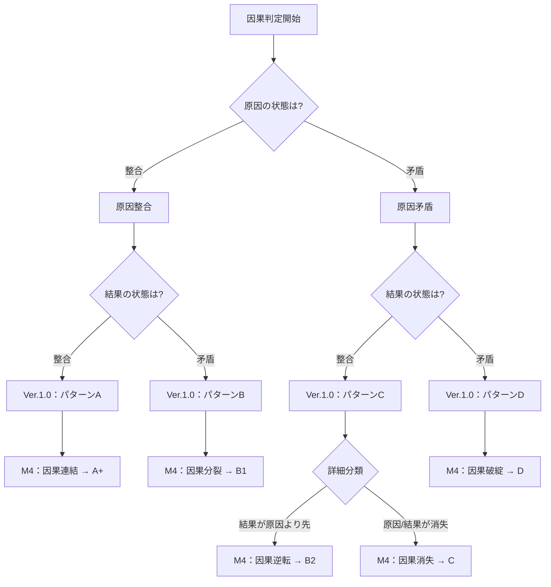
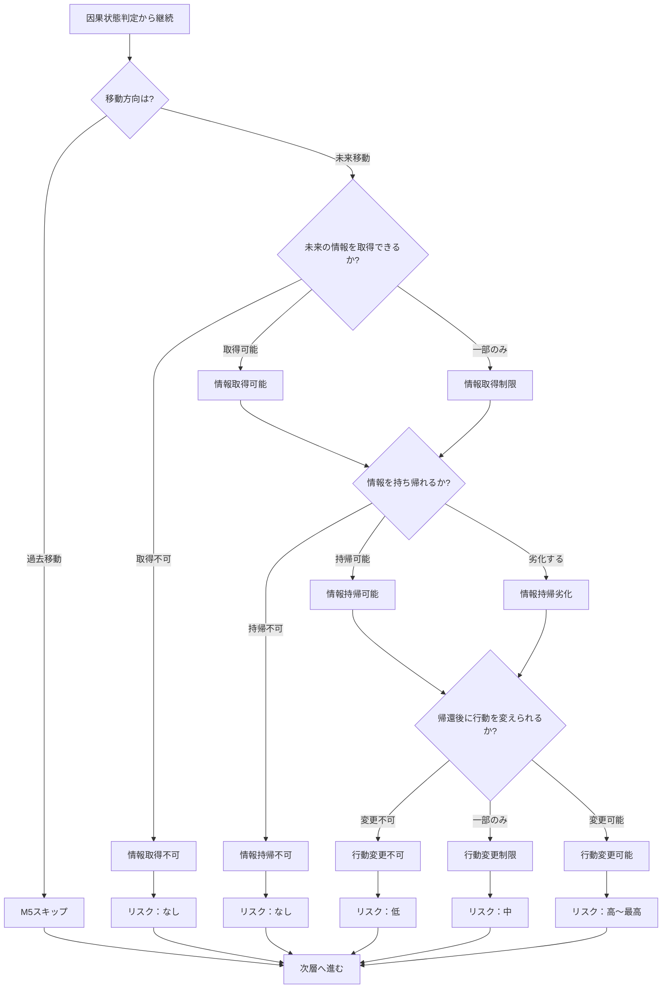
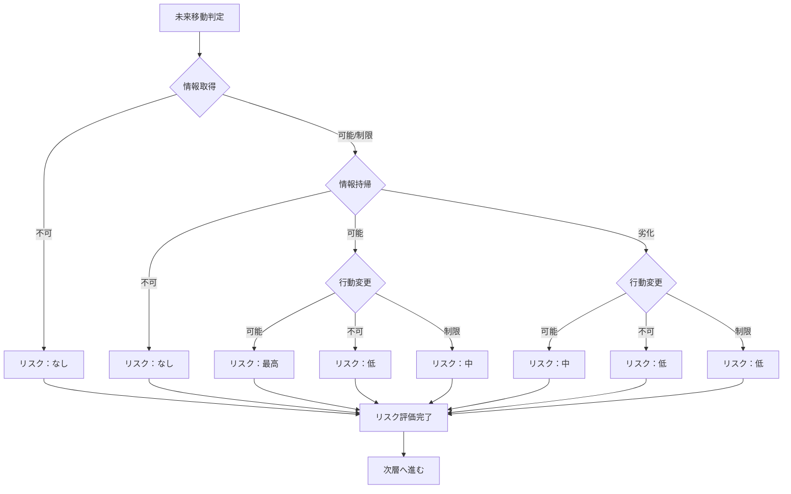

## 付録B：モジュール別フローチャート

### B-1. 概要

本付録では、各モジュール単体のフローチャートを提示する。

個別のモジュールを適用する際の参照用である。

---

### B-2. M1：時間存在条件フロー

---

### B-3. M2：移動経路条件フロー

---

### B-4. M3：圧力条件フロー

---

### B-5. M3：時間圧×空間圧マトリクスフロー

---

### B-6. M4：因果細分化フロー

---

### B-7. M4：Ver.1.0パターンとの対応フロー

---

### B-8. M5：未来移動条件フロー

---

### B-9. M5：リスクマトリクスフロー

---

### B-10. モジュール別判定ポイントサマリ

|モジュール|判定ポイント|検証終了条件|
|---|---|---|
|M1|時間存在|時間不在、時間存在不明|
|M2|入口存在、経路状態、出口存在|入口不在、経路崩壊、経路閉鎖、出口不在|
|M3|時間圧、空間圧|時間圧限界超え|
|M4|因果状態|なし（全てパターン分類へ）|
|M5|情報取得、情報持帰、行動変更|なし（全てリスク評価へ）|

---
