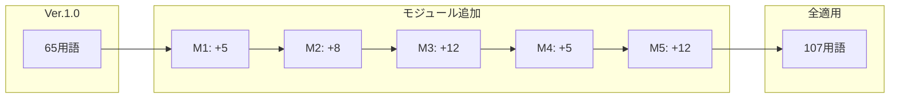

## 第10章：用語統計

### 10-1. 概要

本章では、拡張モジュール集に含まれる全42用語の一覧と、分類別の統計を提示する。

---

### 10-2. モジュール別用語数

|モジュール|名称|カテゴリ数|用語数|
|---|---|---|---|
|M1|時間存在条件|1|5|
|M2|移動経路条件|2|8|
|M3|圧力条件|2|12|
|M4|因果細分化|1|5|
|M5|未来移動条件|4|12|
|**合計**||**10**|**42**|

---

### 10-3. M1：時間存在条件 用語一覧

|No.|用語|英語|定義|
|---|---|---|---|
|1|過去時間存在|Past Time Exists|過去が移動先として存在する状態|
|2|過去時間不在|Past Time Absent|過去が存在せず移動不能な状態|
|3|未来時間存在|Future Time Exists|未来が移動先として存在する状態|
|4|未来時間不在|Future Time Absent|未来が存在せず移動不能な状態|
|5|時間存在不明|Time Existence Unknown|存在するか検証不能な状態|

---

### 10-4. M2：移動経路条件 用語一覧

|No.|カテゴリ|用語|英語|定義|
|---|---|---|---|---|
|6|タイムホール構造|タイムホール|Time Hole|時間移動を可能にする時空の通路|
|7|タイムホール構造|時間領域入口|Time Domain Entrance|時間移動を開始する時空の接点|
|8|タイムホール構造|時間領域|Time Domain|入口と出口を繋ぐ移動経路の時空領域|
|9|タイムホール構造|時間領域出口|Time Domain Exit|時間移動を終了する時空の接点|
|10|経路状態|経路安定|Pathway Stable|移動中に経路が維持される状態|
|11|経路状態|経路不安定|Pathway Unstable|移動中に経路が変動する状態|
|12|経路状態|経路崩壊|Pathway Collapse|移動中に経路が消失する状態|
|13|経路状態|経路閉鎖|Pathway Closed|入口または出口が閉じて通過不能な状態|

---

### 10-5. M3：圧力条件 用語一覧

|No.|カテゴリ|用語|英語|定義|
|---|---|---|---|---|
|14|時間圧|時間圧|Time Pressure|時間領域内で旅行者にかかる負荷|
|15|時間圧|時間圧係数|Time Pressure Coefficient|時間圧の度合いを示す値|
|16|時間圧|低時間圧|Low Time Pressure|負荷が小さく安全に通過可能|
|17|時間圧|中時間圧|Medium Time Pressure|一定の負荷があり影響を受ける可能性|
|18|時間圧|高時間圧|High Time Pressure|負荷が大きく損傷リスクあり|
|19|時間圧|時間圧限界|Time Pressure Threshold|これを超えると通過不能または致命的|
|20|空間圧|空間圧|Spatial Pressure|各空間座標点における存在負荷|
|21|空間圧|空間圧係数|Spatial Pressure Coefficient|空間圧の度合いを示す値|
|22|空間圧|空間圧均衡|Spatial Pressure Balance|出発地と到達地の空間圧が同等|
|23|空間圧|空間圧差異|Spatial Pressure Differential|出発地と到達地の空間圧に差がある|
|24|空間圧|空間圧過剰|Spatial Pressure Excess|空間圧が高すぎて存在に影響|
|25|空間圧|空間圧真空|Spatial Pressure Vacuum|空間圧がゼロまたは極端に低い状態|

---

### 10-6. M4：因果細分化 用語一覧

|No.|用語|英語|定義|
|---|---|---|---|
|26|因果連結|Causal Connection|原因と結果が正常に繋がっている状態|
|27|因果分裂|Causal Split|一つの原因から複数の矛盾した結果が発生する状態|
|28|因果破綻|Causal Breakdown|原因と結果の繋がりが完全に崩壊した状態|
|29|因果逆転|Causal Reversal|結果が原因より先に発生する状態|
|30|因果消失|Causal Loss|原因または結果が存在から消える状態|

---

### 10-7. M5：未来移動条件 用語一覧

|No.|カテゴリ|用語|英語|定義|
|---|---|---|---|---|
|31|未来情報取得|情報取得可能|Information Acquisition Possible|未来の情報を得られる状態|
|32|未来情報取得|情報取得不可|Information Acquisition Impossible|未来の情報を得られない状態|
|33|未来情報取得|情報取得制限|Information Acquisition Limited|一部の情報のみ得られる状態|
|34|未来情報持帰|情報持帰可能|Information Return Possible|現在に情報を持ち帰れる状態|
|35|未来情報持帰|情報持帰不可|Information Return Impossible|持ち帰ると情報が消える状態|
|36|未来情報持帰|情報持帰劣化|Information Return Degraded|持ち帰ると一部が劣化する状態|
|37|未来干渉|未来干渉可能|Future Interference Possible|未来で行動できる状態|
|38|未来干渉|未来干渉不可|Future Interference Impossible|観測のみで干渉できない状態|
|39|未来干渉|未来干渉制限|Future Interference Limited|一部の行動のみ可能な状態|
|40|帰還後影響|行動変更可能|Action Change Possible|情報を元に行動を変えられる状態|
|41|帰還後影響|行動変更不可|Action Change Impossible|情報があっても行動を変えられない状態|
|42|帰還後影響|行動変更制限|Action Change Limited|一部の行動のみ変更可能な状態|

---

### 10-8. カテゴリ別統計

|モジュール|カテゴリ|用語数|
|---|---|---|
|M1|時間存在|5|
|M2|タイムホール構造|4|
|M2|経路状態|4|
|M3|時間圧|6|
|M3|空間圧|6|
|M4|因果状態（拡張）|5|
|M5|未来情報取得|3|
|M5|未来情報持帰|3|
|M5|未来干渉|3|
|M5|帰還後影響|3|
|**合計**|**10カテゴリ**|**42**|

---

### 10-9. 適用タイプ別統計

|適用タイプ|モジュール|用語数|
|---|---|---|
|既存層拡張|M1、M4|10|
|新層追加|M2、M3、M5|32|
|**合計**||**42**|

---

### 10-10. Ver.1.0 + 全モジュール適用時の総用語数

|区分|用語数|
|---|---|
|Ver.1.0 本文|55|
|Ver.1.0 付録含む|65|
|拡張モジュール|42|
|**総計（本文）**|**97**|
|**総計（付録含む）**|**107**|

---

### 10-11. 用語数推移グラフ

---
