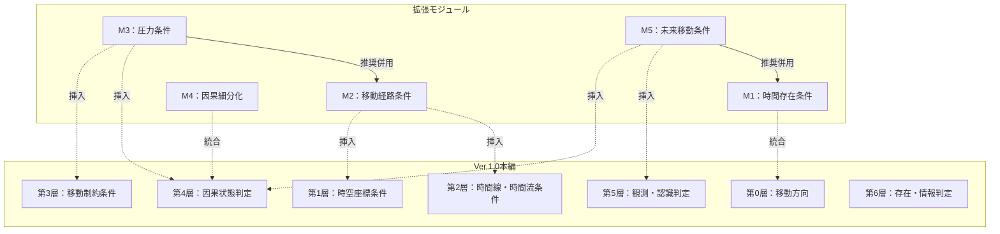

## 第2章：モジュール一覧

### 2-1. 概要

本章では、拡張モジュール集に含まれる全5モジュールの概要を一覧で提示する。

各モジュールの詳細は第3章〜第7章で個別に解説する。

---

### 2-2. モジュール一覧

|モジュール|名称|用語数|適用タイプ|概要|
|---|---|---|---|---|
|M1|時間存在条件|5|既存層拡張|過去・未来が存在するかを判定|
|M2|移動経路条件|8|新層追加|タイムホール構造と経路状態を判定|
|M3|圧力条件|12|新層追加|時間圧・空間圧の負荷を判定|
|M4|因果細分化|5|既存層拡張|因果状態をより詳細に分類|
|M5|未来移動条件|12|新層追加|未来情報の取得・持帰・影響を判定|

---

### 2-3. 挿入位置

| モジュール | Ver.1.0での挿入位置 | 適用後の層番号     |
| ----- | ------------- | ----------- |
| M1    | 第0層に統合        | 第0層（カテゴリ追加） |
| M2    | 第1層と第2層の間     | 新・第2層       |
| M3    | 第3層と第4層の間     | 新・第5層       |
| M4    | 第4層に統合        | 第4層（カテゴリ追加） |
| M5    | 第4層と第5層の間     | 新・第7層       |

---

### 2-4. カテゴリ構成

|モジュール|カテゴリ数|カテゴリ名|
|---|---|---|
|M1|1|時間存在|
|M2|2|タイムホール構造、経路状態|
|M3|2|時間圧、空間圧|
|M4|1|因果状態（拡張）|
|M5|4|未来情報取得、未来情報持帰、未来干渉、帰還後影響|

---

### 2-5. 依存関係

|モジュール|依存先|依存内容|
|---|---|---|
|M1|なし|単独で適用可能|
|M2|なし|単独で適用可能|
|M3|M2（推奨）|経路通過後の圧力判定のため、M2との併用を推奨|
|M4|なし|単独で適用可能|
|M5|M1（推奨）|未来時間存在の判定があると整合性が向上|

---

### 2-6. 用語数の影響

|適用パターン|追加用語数|総用語数|
|---|---|---|
|Ver.1.0のみ|0|65|
|M1のみ|+5|70|
|M2のみ|+8|73|
|M3のみ|+12|77|
|M4のみ|+5|70|
|M5のみ|+12|77|
|M1 + M5|+17|82|
|M2 + M3|+20|85|
|全モジュール|+42|107|

---

### 2-7. 検証状態

|モジュール|検証状態|備考|
|---|---|---|
|M1|未検証|哲学的立場により結果が変わる|
|M2|未検証|物理学的定義が未確立|
|M3|未検証|測定単位が未定義|
|M4|未検証|妥当性検証が必要|
|M5|未検証|妥当性検証が必要|

---

### 2-8. モジュール関係図

---
