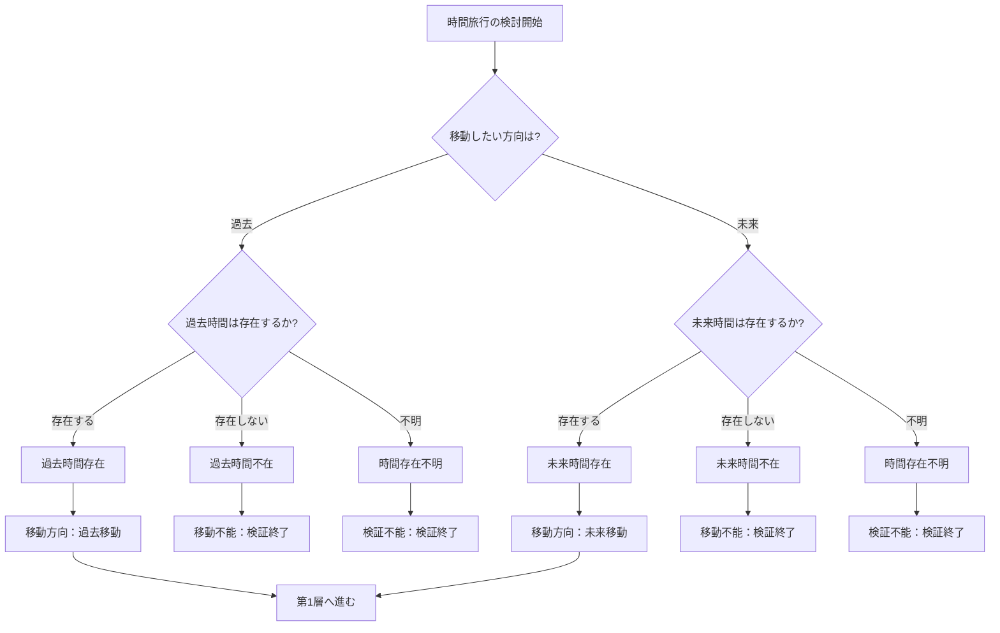

## 第3章：M1：時間存在条件

### 3-1. 概要

M1は、時間旅行の前提となる「移動先の時間が存在するか」を判定するモジュールである。

Ver.1.0では過去・未来の存在を暗黙の前提としているが、本モジュールを適用することで、その前提自体を検証対象に含めることができる。

|項目|内容|
|---|---|
|モジュール名|M1：時間存在条件|
|英語名|Time Existence Conditions|
|適用タイプ|既存層拡張（第0層に統合）|
|カテゴリ数|1|
|用語数|5|
|依存|なし|

---

### 3-2. 適用による変化

|項目|Ver.1.0|M1適用後|
|---|---|---|
|第0層の名称|移動方向|移動方向（時間存在判定含む）|
|第0層のカテゴリ数|1|2|
|第0層の用語数|2|7|
|判定順序|移動方向のみ|時間存在 → 移動方向|

---

### 3-3. カテゴリ構成

|カテゴリ|用語数|内容|
|---|---|---|
|時間存在|5|移動先の時間が存在するかを判定|
|移動方向|2|過去か未来かを判定（Ver.1.0既存）|

---

### 3-4. 用語定義

|用語|英語|定義|
|---|---|---|
|過去時間存在|Past Time Exists|過去が移動先として存在する状態|
|過去時間不在|Past Time Absent|過去が存在せず移動不能な状態|
|未来時間存在|Future Time Exists|未来が移動先として存在する状態|
|未来時間不在|Future Time Absent|未来が存在せず移動不能な状態|
|時間存在不明|Time Existence Unknown|存在するか検証不能な状態|

---

### 3-5. 哲学的立場との対応

|哲学的立場|過去|未来|M1での判定結果|
|---|---|---|---|
|ブロック宇宙論|存在|存在|両方向へ移動可能|
|現在主義|不在|不在|両方向とも移動不能|
|成長ブロック宇宙論|存在|不在|過去のみ移動可能|
|不可知論|不明|不明|検証不能|

---

### 3-6. 判定結果と後続処理

|判定結果|後続処理|
|---|---|
|過去時間存在|移動方向「過去移動」を選択可能 → 第1層へ|
|過去時間不在|過去への移動不能 → 検証終了|
|未来時間存在|移動方向「未来移動」を選択可能 → 第1層へ|
|未来時間不在|未来への移動不能 → 検証終了|
|時間存在不明|検証不能 → 検証終了|

---

### 3-7. 判定フロー

---

### 3-8. Ver.1.0との互換性

|条件|挙動|
|---|---|
|M1未適用時|Ver.1.0と同一（時間存在を暗黙に「存在する」と仮定）|
|M1適用・全て「存在」|Ver.1.0と同一の結果|
|M1適用・一部「不在」|該当方向への移動は検証終了|
|M1適用・「不明」|検証不能として終了|

---

### 3-9. 適用時の注意事項

|項目|内容|
|---|---|
|哲学的前提|採用する哲学的立場により結果が異なる。シナリオ検証時は立場を明示すること|
|検証不能の増加|「時間存在不明」を選択すると即座に検証終了となる|
|フィクションでの運用|作品世界の時間観に応じて判定基準を設定すること|

---
