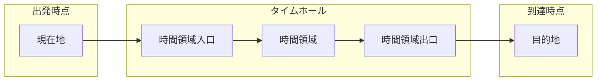
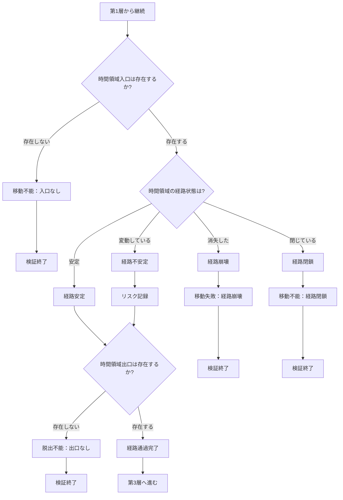

## 第4章：M2：移動経路条件

### 4-1. 概要

M2は、時間移動の「経路」を判定するモジュールである。

Ver.1.0では移動の「方向」「到達精度」「制約」を扱うが、出発点から到達点までの経路自体は判定対象外となっている。本モジュールを適用することで、タイムホールの構造と経路の安定性を検証対象に含めることができる。

|項目|内容|
|---|---|
|モジュール名|M2：移動経路条件|
|英語名|Movement Pathway Conditions|
|適用タイプ|新層追加（第1層と第2層の間）|
|カテゴリ数|2|
|用語数|8|
|依存|なし|

---

### 4-2. 適用による変化

|項目|Ver.1.0|M2適用後|
|---|---|---|
|層数|7層|8層|
|第2層|時間線・時間流条件|移動経路条件（新）|
|第3層|移動制約条件|時間線・時間流条件（繰り下げ）|
|以降の層|-|全て+1繰り下げ|

---

### 4-3. カテゴリ構成

|カテゴリ|用語数|内容|
|---|---|---|
|タイムホール構造|4|移動経路の入口・領域・出口|
|経路状態|4|経路の安定性|

---

### 4-4. タイムホール構造（Time Hole Structure）

|用語|英語|定義|
|---|---|---|
|タイムホール|Time Hole|時間移動を可能にする時空の通路|
|時間領域入口|Time Domain Entrance|時間移動を開始する時空の接点|
|時間領域|Time Domain|入口と出口を繋ぐ移動経路の時空領域|
|時間領域出口|Time Domain Exit|時間移動を終了する時空の接点|

---

### 4-5. 経路状態（Pathway State）

| 用語    | 英語                | 定義                 |
| ----- | ----------------- | ------------------ |
| 経路安定  | Pathway Stable    | 移動中に経路が維持される状態     |
| 経路不安定 | Pathway Unstable  | 移動中に経路が変動する状態      |
| 経路崩壊  | Pathway Collapsed | 移動中に経路が消失する状態      |
| 経路閉鎖  | Pathway Closed    | 入口または出口が閉じて通過不能な状態 |

---

### 4-6. タイムホール構造図

---

### 4-7. 経路状態と結果

|経路状態|移動可否|結果|後続処理|
|---|---|---|---|
|経路安定|可能|安全に通過|第3層へ進む|
|経路不安定|可能（リスクあり）|予期せぬ影響の可能性|第3層へ進む（リスク記録）|
|経路崩壊|不可|移動失敗|検証終了|
|経路閉鎖|不可|移動不能|検証終了|

---

### 4-8. 入口・出口の状態組み合わせ

|入口|出口|結果|
|---|---|---|
|存在|存在|通過可能（経路状態を判定）|
|存在|不在|脱出不能（移動先で閉じ込め）|
|不在|存在|移動不能（入口なし）|
|不在|不在|移動不能（経路自体が存在しない）|

---

### 4-9. 判定フロー

---

### 4-10. Ver.1.0との互換性

|条件|挙動|
|---|---|
|M2未適用時|Ver.1.0と同一（経路は暗黙に「安定・通過可能」と仮定）|
|M2適用・経路安定|Ver.1.0と同一の結果で後続層へ|
|M2適用・経路不安定|リスクを記録して後続層へ|
|M2適用・経路崩壊/閉鎖|移動失敗として検証終了|

---

### 4-11. M3（圧力条件）との関係

|関係|内容|
|---|---|
|推奨併用|M3はタイムホール内での圧力を扱うため、M2との併用を推奨|
|単独適用|M2単独でも適用可能。その場合、圧力は判定対象外|
|判定順序|M2（経路通過） → M3（圧力判定）の順で処理|

---

### 4-12. 適用時の注意事項

|項目|内容|
|---|---|
|物理学的定義|タイムホールは理論上の概念であり、物理学的に確立されていない|
|検証終了の増加|経路崩壊・経路閉鎖・出口不在で検証が終了するケースが増える|
|フィクションでの運用|作品世界の時間移動手段に応じて経路状態を設定すること|

---
