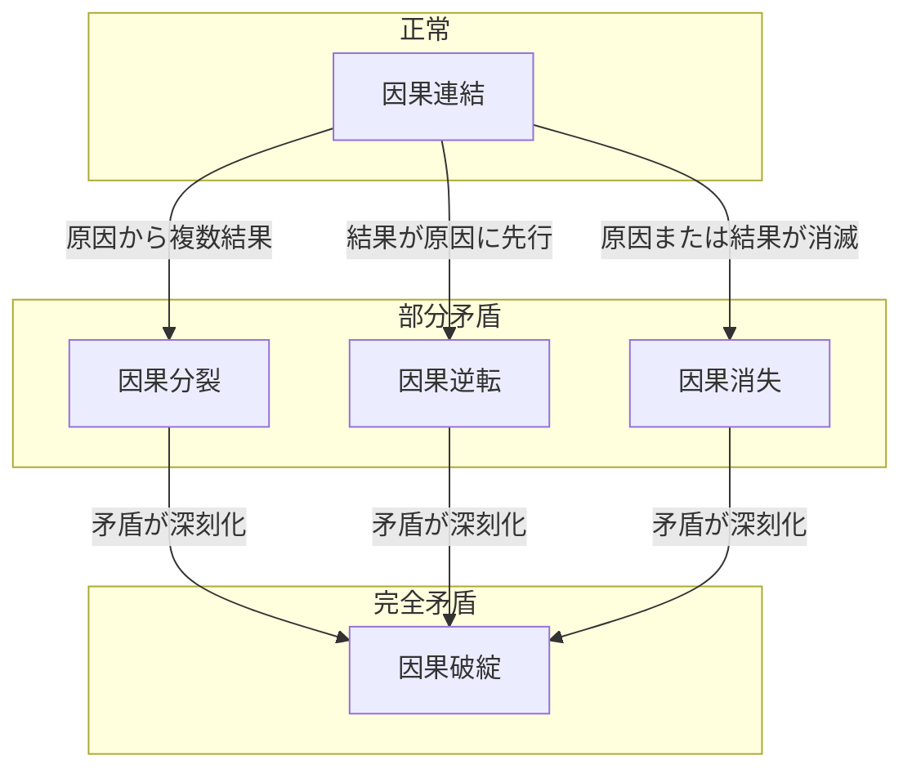
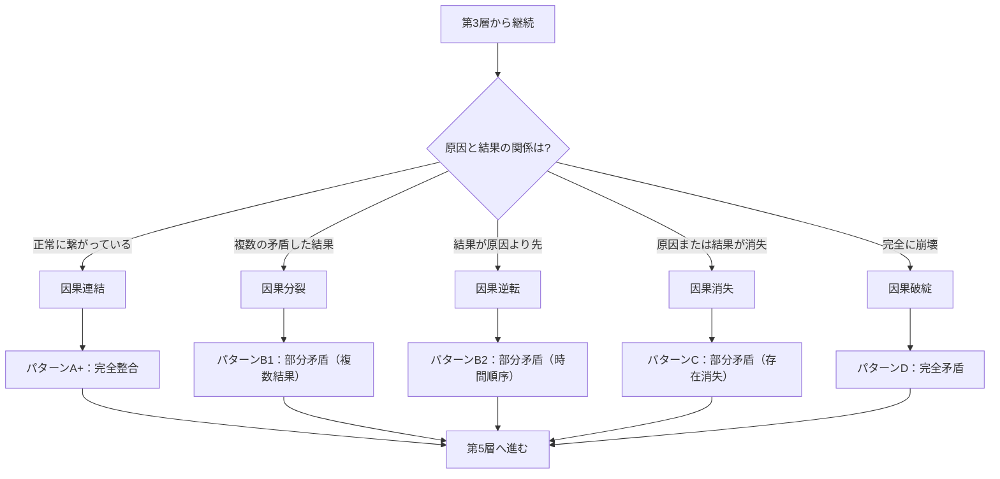

## 第6章：M4：因果細分化

### 6-1. 概要

M4は、Ver.1.0の第4層（因果状態判定）をより詳細に分類するモジュールである。

Ver.1.0では因果状態を4パターン（A〜D）で判定するが、本モジュールを適用することで、因果の状態をより精密に分類し、パラドックスの種類を特定できるようになる。

|項目|内容|
|---|---|
|モジュール名|M4：因果細分化|
|英語名|Causal State Subdivision|
|適用タイプ|既存層拡張（第4層に統合）|
|カテゴリ数|1|
|用語数|5|
|依存|なし|

---

### 6-2. 適用による変化

|項目|Ver.1.0|M4適用後|
|---|---|---|
|第4層の名称|因果状態判定|因果状態判定（拡張）|
|第4層のカテゴリ数|3|4|
|第4層の用語数|10|15|
|判定パターン|4パターン（A〜D）|5パターン（A+、B1、B2、C、D）|

---

### 6-3. カテゴリ構成

|カテゴリ|用語数|内容|備考|
|---|---|---|---|
|原因矛盾/整合|2|原因側の状態|Ver.1.0既存|
|結果矛盾/整合|2|結果側の状態|Ver.1.0既存|
|時間矛盾/整合|6|総合的な判定パターン|Ver.1.0既存|
|因果状態（拡張）|5|因果の詳細分類|新規追加|

---

### 6-4. 因果状態（拡張）用語定義

|用語|英語|定義|
|---|---|---|
|因果連結|Causal Connection|原因と結果が正常に繋がっている状態|
|因果分裂|Causal Split|一つの原因から複数の矛盾した結果が発生する状態|
|因果破綻|Causal Breakdown|原因と結果の繋がりが完全に崩壊した状態|
|因果逆転|Causal Reversal|結果が原因より先に発生する状態|
|因果消失|Causal Loss|原因または結果が存在から消える状態|

---

### 6-5. Ver.1.0用語との対応

|Ver.1.0|M4拡張|関係|
|---|---|---|
|パターンA（完全整合）|因果連結|正常状態の明確化|
|パターンB（結果破綻）|因果分裂|矛盾の種類を細分化|
|パターンC（原因破綻）のうち結果が原因より時間的に先行するもの|因果逆転|特殊パターンの明示|
|パターンC（原因破綻）のうち原因または結果が存在から消失するもの|因果消失|消失パターンの明示|
|パターンD（完全矛盾）|因果破綻|より直接的な表現|

---

### 6-6. 判定パターンの変化

|Ver.1.0|M4適用後|因果状態|結果|
|---|---|---|---|
|パターンA|パターンA+|因果連結|完全整合|
|パターンB|パターンB1|因果分裂|部分矛盾（複数結果）|
|-|パターンB2|因果逆転|部分矛盾（時間順序）|
|パターンC|パターンC|因果消失|部分矛盾（存在消失）|
|パターンD|パターンD|因果破綻|完全矛盾|

---

### 6-7. 各パターンの具体例

|パターン|因果状態|具体例|
|---|---|---|
|A+|因果連結|過去に行って何も変えず戻った。因果関係は完全に維持|
|B1|因果分裂|一つの介入から「歴史が変わった世界」と「変わらなかった世界」が同時に発生|
|B2|因果逆転|未来で見た設計図を過去に持ち帰り、その設計図が作られる原因になった（ブートストラップ）|
|C|因果消失|祖父を殺したことで自分の存在原因が消失した|
|D|因果破綻|祖父を殺したのに自分が存在し、その自分が祖父を殺し続ける無限矛盾|

---

### 6-8. 因果状態の関係図

---

### 6-9. 判定フロー

---

### 6-10. Ver.1.0判定との併用

|判定方法|内容|
|---|---|
|Ver.1.0のみ|原因整合/矛盾 × 結果整合/矛盾 の2×2で判定|
|M4併用|Ver.1.0判定 + 因果状態の詳細分類|
|推奨|Ver.1.0で大枠を判定 → M4で詳細を特定|

---

### 6-11. 判定順序

|ステップ|内容|
|---|---|
|Step 1|原因側の状態を判定（整合/矛盾）|
|Step 2|結果側の状態を判定（整合/矛盾）|
|Step 3|Ver.1.0パターン（A〜D）を特定|
|Step 4|因果状態（拡張）を特定|
|Step 5|M4パターン（A+、B1、B2、C、D）を確定|

---

### 6-12. Ver.1.0との互換性

**基本ルール**

|条件|挙動|
|---|---|
|M4未適用時|Ver.1.0と同一（4パターンで判定）|
|M4適用時|下記の対応表に従い、5パターンで判定|

**パターン対応表**

|Ver.1.0パターン|M4パターン|対応する因果状態|
|---|---|---|
|パターンA|パターンA+|因果連結|
|パターンB|パターンB1|因果分裂|
|パターンC|パターンB2 またはパターンC|下記の分岐基準に従う|
|パターンD|パターンD|因果破綻|

**パターンC分岐基準**

Ver.1.0のパターンC（原因破綻）に該当するケースは、M4適用時に以下の基準で分岐する。

|判定基準|該当例|M4分類|M4パターン|
|---|---|---|---|
|結果が原因より時間的に先行している|未来から持ち帰った設計図が、その設計図自体の起源になっている|因果逆転|B2|
|原因または結果が存在から消失している|祖父を殺したことで自分の存在原因が消失した|因果消失|C|
|上記いずれにも該当しない|原因と結果の繋がりが説明不能かつ上記2条件に当てはまらない|因果破綻|D|

---

### 6-13. 適用時の注意事項

|項目|内容|
|---|---|
|判定の複雑化|4パターン→5パターンに増加し、判定がやや複雑になる|
|境界の曖昧さ|因果分裂と因果逆転の境界が曖昧なケースがある|
|妥当性検証|本モジュールの分類は検討段階であり、適用テストが必要|
|フィクションでの運用|パラドックスの種類を明示したい場合に有効|

---
