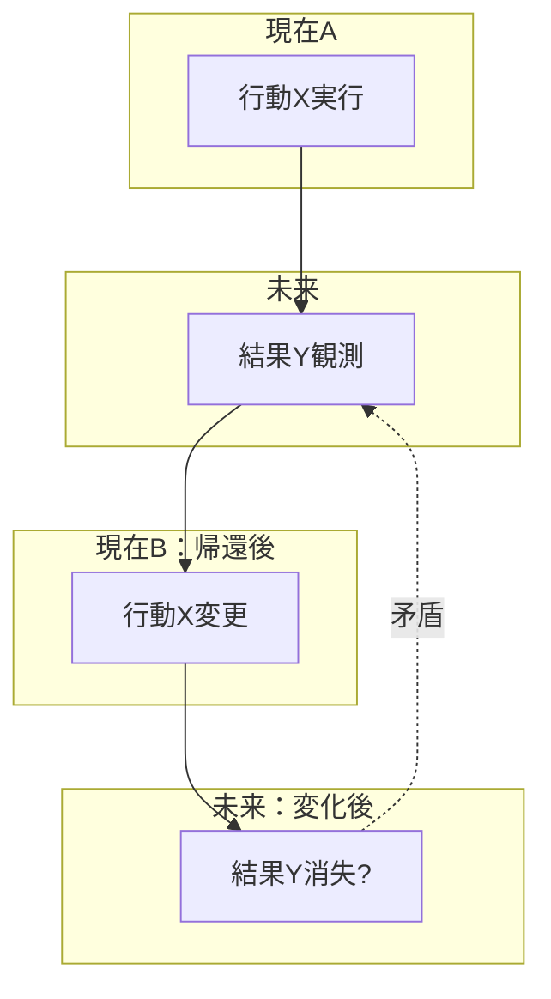
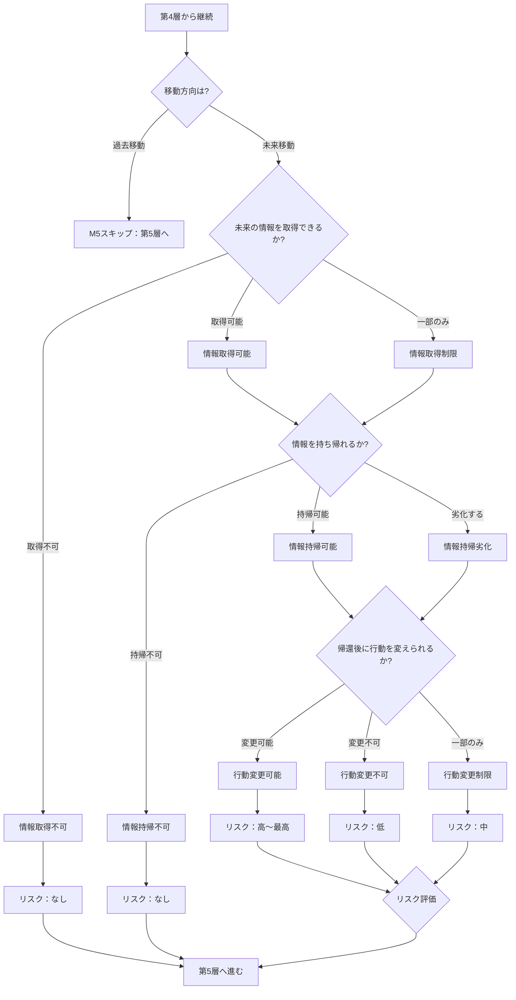

## 第7章：M5：未来移動条件

### 7-1. 概要

M5は、未来移動時の情報取得・持帰・影響を判定するモジュールである。

Ver.1.0では未来移動は「パラドックスリスク低」として簡略化されているが、未来の情報を取得し現在に持ち帰り行動を変更する場合、実質的なパラドックスが発生しうる。本モジュールを適用することで、未来移動特有の問題を検証対象に含めることができる。

|項目|内容|
|---|---|
|モジュール名|M5：未来移動条件|
|英語名|Future Movement Conditions|
|適用タイプ|新層追加（第4層と第5層の間）|
|カテゴリ数|4|
|用語数|12|
|依存|M1（推奨）|

---

### 7-2. 適用による変化

|項目|Ver.1.0|M5適用後|
|---|---|---|
|層数|7層|8層|
|第5層|観測・認識判定|未来移動条件（新）|
|第6層|存在・情報判定|観測・認識判定（繰り下げ）|
|以降の層|-|全て+1繰り下げ|

---

### 7-3. カテゴリ構成

|カテゴリ|用語数|内容|
|---|---|---|
|未来情報取得|3|未来の情報を得られるか|
|未来情報持帰|3|現在に情報を持ち帰れるか|
|未来干渉|3|未来で行動できるか|
|帰還後影響|3|戻った後に行動を変えられるか|

---

### 7-4. 未来情報取得（Future Information Acquisition）

|用語|英語|定義|
|---|---|---|
|情報取得可能|Information Acquisition Possible|未来の情報を得られる状態|
|情報取得不可|Information Acquisition Impossible|未来の情報を得られない状態|
|情報取得制限|Information Acquisition Limited|一部の情報のみ得られる状態|

---

### 7-5. 未来情報持帰（Future Information Return）

|用語|英語|定義|
|---|---|---|
|情報持帰可能|Information Return Possible|現在に情報を持ち帰れる状態|
|情報持帰不可|Information Return Impossible|持ち帰ると情報が消える状態|
|情報持帰劣化|Information Return Degraded|持ち帰ると一部が劣化する状態|

---

### 7-6. 未来干渉（Future Interference）

|用語|英語|定義|
|---|---|---|
|未来干渉可能|Future Interference Possible|未来で行動できる状態|
|未来干渉不可|Future Interference Impossible|観測のみで干渉できない状態|
|未来干渉制限|Future Interference Limited|一部の行動のみ可能な状態|

---

### 7-7. 帰還後影響（Post-Return Effect）

|用語|英語|定義|
|---|---|---|
|行動変更可能|Action Change Possible|情報を元に行動を変えられる状態|
|行動変更不可|Action Change Impossible|情報があっても行動を変えられない状態|
|行動変更制限|Action Change Limited|一部の行動のみ変更可能な状態|

---

### 7-8. 未来移動のパラドックス構造

---

### 7-9. 情報取得×情報持帰×帰還後影響マトリクス

|情報取得|情報持帰|帰還後影響|パラドックスリスク|結果|
|---|---|---|---|---|
|可能|可能|変更可能|最高|実質パラドックス製造機|
|可能|可能|変更不可|低|知っているが変えられない|
|可能|可能|変更制限|中|一部のみ変更可能|
|可能|不可|-|なし|見たが忘れる|
|可能|劣化|変更可能|中|不完全な情報で判断|
|可能|劣化|変更不可|低|不完全な情報、変更不可|
|不可|-|-|なし|何も分からない|
|制限|可能|変更可能|中|一部情報で行動変更|
|制限|可能|変更制限|低|限定的な影響|

---

### 7-10. 未来干渉の影響

|未来干渉|影響|備考|
|---|---|---|
|干渉可能|未来を直接変更する可能性|因果への影響大|
|干渉不可|観測のみ、未来は変わらない|因果への影響なし|
|干渉制限|限定的な変更のみ可能|因果への影響は限定的|

---

### 7-11. 判定フロー

---

### 7-12. M1（時間存在条件）との関係

|関係|内容|
|---|---|
|推奨併用|M1で「未来時間存在」を判定してからM5を適用すると整合性が向上|
|単独適用|M5単独でも適用可能。その場合、未来の存在は暗黙に仮定される|
|判定順序|M1（未来時間存在） → 第0層（移動方向） → … → M5（未来移動条件）|

---

### 7-13. 過去移動との比較

|観点|過去移動|未来移動（M5適用時）|
|---|---|---|
|因果への影響|直接的（原因を変更）|間接的（情報による行動変更）|
|パラドックスの種類|祖父殺し、ブートストラップ等|自己成就予言、情報ループ等|
|Ver.1.0での扱い|詳細に判定|簡略化（リスク低）|
|M5適用後|変化なし|詳細に判定可能|

---

### 7-14. Ver.1.0との互換性

|条件|挙動|
|---|---|
|M5未適用時|Ver.1.0と同一（未来移動はリスク低として簡略処理）|
|M5適用・情報取得不可|Ver.1.0と同一の結果（リスクなし）|
|M5適用・情報持帰不可|Ver.1.0と同一の結果（リスクなし）|
|M5適用・行動変更可能|高リスクとして記録、後続層へ|
|M5適用・過去移動時|M5スキップ、Ver.1.0と同一|

---

### 7-15. 適用時の注意事項

|項目|内容|
|---|---|
|適用対象|未来移動時のみ適用。過去移動時はスキップされる|
|判定の複雑化|4カテゴリ×3状態の組み合わせで判定がやや複雑になる|
|哲学的問題|「未来を知ることで未来が変わる」という自己言及的問題を含む|
|フィクションでの運用|未来情報の扱いが物語の核心となる作品で有効|

---
